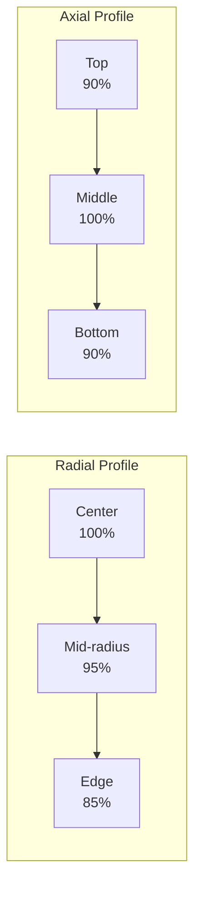

# Acoustic Modeling

!!! warning "CONCEPTUAL PLANNING PHASE ONLY"
    **No hardware exists. No simulations completed. These are conceptual targets only.**

## Standing Wave Formation

### Field Parameters
- Frequency: 40 kHz ± 100 Hz
- Wavelength: 8.58mm (in air at 20°C)
- Pressure amplitude: 2-3 kPa
- Acoustic power: 10W per transducer

## Array Configuration

### Level 1 Configuration (18 transducers)

```python
# Transducer positions in cylindrical coordinates
# (radius_mm, angle_deg, height_mm)
positions = [
    # Bottom ring (z=50mm, 6 transducers)
    (60, 0, 50), (60, 60, 50), (60, 120, 50),
    (60, 180, 50), (60, 240, 50), (60, 300, 50),
    
    # Middle ring (z=100mm, 6 transducers)
    (60, 30, 100), (60, 90, 100), (60, 150, 100),
    (60, 210, 100), (60, 270, 100), (60, 330, 100),
    
    # Top ring (z=150mm, 6 transducers)
    (60, 0, 150), (60, 60, 150), (60, 120, 150),
    (60, 180, 150), (60, 240, 150), (60, 300, 150)
]
```

## Acoustic Force Calculation

The acoustic radiation force on a spherical droplet:

$$F_{ac} = \frac{4\pi r^3}{3} \cdot \frac{p_0^2}{\rho_0 c^2} \cdot k \cdot \Phi$$

Where:
- $r$ = droplet radius (0.5-2mm typical)
- $p_0$ = pressure amplitude (2-3 kPa)
- $\rho_0$ = medium density (1.2 kg/m³ for air)
- $c$ = sound speed (343 m/s at 20°C)
- $k$ = wave number (2π/λ)
- $\Phi$ = acoustic contrast factor

### Acoustic Contrast Factor

For liquid metal droplets in air:

$$\Phi = \frac{1}{3}\left[\frac{5\rho_p - 2\rho_0}{2\rho_p + \rho_0} - \frac{\beta_0}{\beta_p}\right]$$

Typical values:
- Aluminum: Φ ≈ 0.85
- Steel: Φ ≈ 0.91
- Lead: Φ ≈ 0.93

## Field Uniformity Analysis

### Pressure Distribution


### Field Quality Metrics
- Uniformity: ±5% in central 80% of volume
- Stability: <1% drift over 8 hours
- Noise: <0.1% RMS
- THD: <3% at rated power

## Phased Array Control

### Phase Resolution
- FPGA clock: 100 MHz
- Phase steps: 3600 (0.1° resolution)
- Update rate: 1 kHz
- Latency: <100 μs

### Beam Steering Capability
- Lateral range: ±10mm
- Axial range: ±20mm
- Angular resolution: 0.5°
- Focus adjustment: 50-200mm

## Acoustic Impedance Matching

### Transducer-Air Interface
- Transducer impedance: 50 Ω
- Matching network: L-C circuit
- VSWR: <1.5:1
- Power transfer: >95%

### Air-Droplet Interface
- Impedance mismatch: ~10⁶:1
- Reflection coefficient: >0.99
- Transmission: <1%
- Multiple reflections enhance trapping

## Target Performance Specifications (Unvalidated)

### Design Targets
| Parameter | Target Specification | Validation Status |
|-----------|----------------------|-------------------|
| Frequency | 40±0.1 kHz | To be validated |
| Power/transducer | 10W | To be validated |
| Field uniformity | ±5% | To be validated |
| Phase noise | <1° RMS | To be validated |
| Beam steering | ±10mm | To be validated |

## Optimization Recommendations

1. **Array Geometry**
   - Hexagonal packing for better coverage
   - Variable spacing for apodization
   - Focused transducers for stronger gradients

2. **Control Algorithms**
   - Adaptive beamforming
   - Feedback from position sensors
   - Machine learning optimization

3. **Power Efficiency**
   - Class D amplifiers (>90% efficiency)
   - Resonant tracking
   - Dynamic power adjustment
