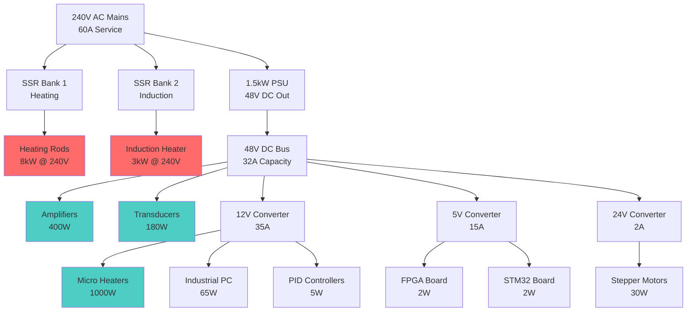

# Power Architecture Analysis

!!! warning "Architecture Update Required"
    System uses dual power domains - AC loads bypass the PSU entirely.
    
## Dual Domain Power Distribution

### AC Domain (Mains Direct)
**Total AC Load: 10005W**

| Component | Voltage | Power | Control Method |
|-----------|---------|-------|----------------|
| Cartridge Heaters 120V (4-pack) | 120V | 4000W | SSR |
| Copper Heated Bed | 120V | 2000W | SSR |
| Induction Heater Module (OEM) | 220V | 3000W | SSR |
| Induction Main Contactor | 48V | 5W | SSR |
| Micro Heaters | 120V | 1000W | SSR |


### DC Domain (PSU Powered)
**Total DC Load: 2439W**

| Component | Voltage | Power | Source |
|-----------|---------|-------|--------|
| 40kHz Transducers | 48V | 180W | PSU |
| Transducer Array Layer | 48V | 5W | PSU |
| Induction EMI Filter | 48V | 2W | PSU |
| Induction Cooling Pump | 12V | 10W | PSU |
| Induction Radiator | 12V | 3W | PSU |
| Induction Flow Sensor | 5V | 0W | PSU |
| Induction Power Meter | 48V | 0W | PSU |
| Induction Interface PCB | 48V | 1W | PSU |
| Pellet Hopper | 48V | 5W | PSU |
| Feedrate Controller | 48V | 10W | PSU |
| Temperature Controller | 48V | 3W | PSU |
| Material Delivery System | 48V | 1000W | PSU |
| Thermal Pulse Formation | 48V | 50W | PSU |
| Mean Well RSP-1500-48 | 48V | 110W | PSU |
| FPGA Board | 5.0V | 2W | PSU |
| 6-Channel Amp Modules | 48V | 400W | PSU |
| 8-Channel Relays | 48V | 10W | PSU |
| STM32 Dev Board | 48V | 0W | PSU |
| Industrial PC | 12V | 0W | PSU |
| Thermal Camera - FLIR A35 | 48V | 12W | PSU |
| Emergency Stop System | 48V | 5W | PSU |
| Inkbird ITC-100VH PID Kit | 12V | 5W | PSU |
| SSR-25DA Solid State Relay | 5V | 0W | PSU |
| 2-Channel Relay Module | 5V | 0W | PSU |
| 48V to 12V DC Converter | 48V | 460W | PSU |
| 48V to 5V DC Converter | 48V | 82W | PSU |
| 48V to 24V DC Converter | 48V | 53W | PSU |
| Control Bus PCB | 48V | 10W | PSU |
| Acoustic Bus PCB | 48V | 5W | PSU |
| Thermal Bus PCB | 48V | 15W | PSU |


## PSU Utilization Analysis

- **PSU Model**: Mean Well RSP-1500-48
- **PSU Capacity**: 1500W
- **DC Load**: 2439W  
- **Utilization**: 162.6%
- **Available Headroom**: -939W

```mermaid
pie title PSU Capacity Utilization
    "Used (2439W)" : 2439.2219999999998
    "Available (-939W)" : -939.2219999999998
```

## Power Distribution Architecture



## Total System Power

- **AC Components**: 10005W
- **DC Components**: 2439W
- **PSU Input Power**: 2680W
- **Total Wall Power**: 12685W

## Electrical Service Requirements

### For AC Loads:
- 120V Circuits: 7000W (58.3A)
- 240V Circuits: 0W (0.0A)

### Recommended Configuration:
- One 240V 60A circuit for all loads
- Subpanel with:
  - 240V 30A breaker for heating (SSR controlled)
  - 240V 20A breaker for induction (SSR controlled)
  - 240V 20A breaker for PSU
  
## Component Control Architecture

### AC Components (SSR Controlled)
- Heating Rods: 4 × 1kW @ 240V → 4ch SSR module
- Heated Bed: Controlled via heating rods
- Induction Heater: 1 × 3kW @ 240V → High-power SSR

### DC Components (Direct Control)
- Transducers: PWM from amplifiers
- Amplifiers: Analog control from FPGA
- Micro Heaters: PWM from control board
- Logic: Direct power from converters

## Safety Considerations

### Protection Requirements
1. **AC Side**
   - GFCI protection on all heating circuits
   - Over-temperature cutouts on SSRs
   - Emergency stop disconnects AC power
   
2. **DC Side**
   - Overcurrent protection on each converter
   - Voltage monitoring on all rails
   - Soft-start circuits for capacitive loads

### Grounding Scheme
- AC ground and DC ground kept separate
- Single-point ground connection at PSU
- Shielded cables for high-frequency signals

## Cost Optimization

### Current Architecture Benefits
1. PSU correctly sized (not oversized for heating)
2. Efficient SSR control for AC loads
3. DC converters only for actual DC loads

### Estimated Component Costs
- 1.5kW PSU (RSP-1500-48): $400
- DC-DC converters: $90 (48V→12V: $40, 48V→5V: $30, 48V→24V: $20)
- SSR modules (8ch): ~$200
- Protection devices: ~$150
- **Total Power Control**: ~$840

### Cost Savings
- Old spec: 15kW PSU @ $3,800
- New spec: 1.5kW PSU @ $400 + DC converters @ $90
- **Savings: $3,310**

## Heated Bed Configuration

### Hardware
- **Heaters**: 4× 1000W @ 120V ($32 total)
  - 2 primary (normal operation)
  - 2 backup/boost/uniformity
- **Control**: Inkbird PID kit + spare SSR ($43)
- **Switching**: 2-channel relay module ($12)
- **Sensors**: 2× Type K thermocouples ($10 included)

### Operating Modes
| Mode | Active Heaters | Power | Use Case |
|------|---------------|-------|----------|
| Normal | H1+H2 | 2000W | Standard operation |
| Economy | H1 only | 1000W | Maintain temperature |
| Boost | All 4 | 4000W | Fast heat-up |
| Redundant | H3+H4 | 2000W | If primary fails |
| Alternating | H1+H2 ↔ H3+H4 | 2000W | Even wear |

### Cost Breakdown
- Heaters: $32
- Control: $65
- **Total: $97** (under $100 budget!)

## Recommendations

1. **Immediate Implementation**
   - Install appropriate SSRs for AC loads
   - Verify PSU is connected only to DC loads
   - Test emergency stop cuts both AC and DC

2. **Future Improvements**
   - Add power monitoring on both domains
   - Implement soft-start for heating elements
   - Consider phase angle control for finer heating control

3. **Safety Critical**
   - Never connect AC loads through the PSU
   - Ensure proper isolation between domains
   - Regular thermal imaging of power connections
