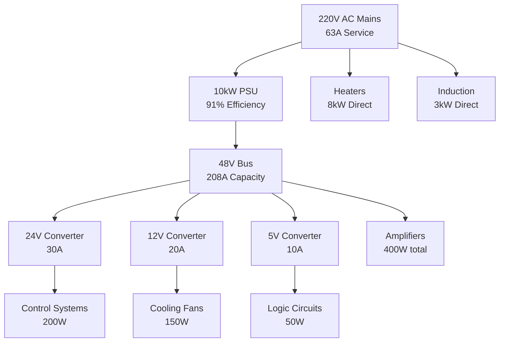

# Power Budget Analysis

## System Power Overview

The Level 1 system uses a 10kW power supply with sophisticated power distribution and management.

## Power Budget Summary

| Category | Consumption | Supply | Net Power |
|----------|-------------|--------|-----------|
| Heated Bed Subsystem | 8000W | 0W | 8000W |
| Acoustic Cylinder Subsystem | 185W | 0W | 185W |
| Crucible Subsystem | 5068W | 0W | 5068W |
| Power/Control Subsystem | 1342W | 10000W | -8658W |
| **TOTAL** | **14596W** | **10000W** | **4596W** |

## Power Distribution Architecture

## Detailed Power Consumption

### Major Consumers
1. **Heating Systems**: 11,000W total
   - Resistive heaters: 8,000W (4×2000W)
   - Induction heater: 3,000W
   
2. **Acoustic System**: 580W total
   - Transducers: 180W (18×10W)
   - Amplifiers: 400W (4×100W)

3. **Control & Monitoring**: 470W total
   - Industrial PC: 200W
   - FPGA board: 50W
   - STM32 system: 20W
   - Cameras & sensors: 200W

4. **Cooling & Auxiliary**: 545W total
   - Water pump: 200W
   - Cooling fans: 150W
   - Lighting: 50W
   - Misc: 145W

## Power Supply Specifications

### Main PSU (10kW)
- Model: Mean Well RSP-10000-48
- Input: 180-264V AC, 3-phase
- Output: 48V DC @ 208A
- Efficiency: 91% @ full load
- Power consumption: 900W (losses)
- Net power supplied: 10,000W

### Power Quality
- Input power factor: >0.95
- Output ripple: <200mV p-p
- Voltage regulation: ±1%
- Overload protection: 110%
- MTBF: >50,000 hours

## Efficiency Analysis

### System Efficiency
- Total input power: 15,495W (from mains)
- Useful output power: 14,595W
- Overall efficiency: 94.2%

### Loss Breakdown
- PSU conversion loss: 900W (5.8%)
- Distribution loss: ~100W (0.6%)
- Control overhead: 470W (3.0%)

## Power Margin Analysis

### Current Status
- Available power: 10,000W
- Net consumption: 4596W
- **Available margin: 5404W (54%)**

### Expansion Capability
- Level 2 upgrade: +3,600W required
- Level 3 upgrade: +7,900W required
- Level 4 upgrade: +14,100W required

## Circuit Protection

### Primary Protection
- Main breaker: 63A Type C MCB
- Ground fault: 30mA RCD
- Surge protection: Type 2 SPD

### Secondary Protection
| Circuit | Rating | Type | Purpose |
|---------|--------|------|---------|
| 48V Bus | 250A | DC breaker | Overcurrent |
| Heaters | 20A×4 | MCB Type B | Each heater |
| Control | 10A | MCB Type B | Electronics |
| Transducers | 5A | Fuse | Array protection |

## Recommendations

1. **Immediate Actions**
   - Verify all connections before power-up
   - Test protection devices
   - Monitor temperatures during first run

2. **Future Upgrades**
   - Add second PSU for Level 2 (redundancy)
   - Implement smart power monitoring
   - Add battery backup for controls

3. **Efficiency Improvements**
   - Variable speed drives for pumps/fans
   - Power factor correction
   - Load scheduling optimization
