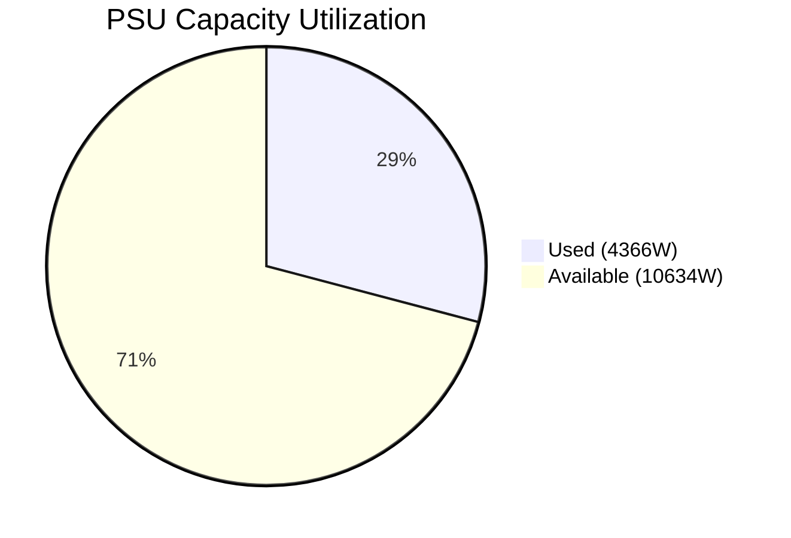
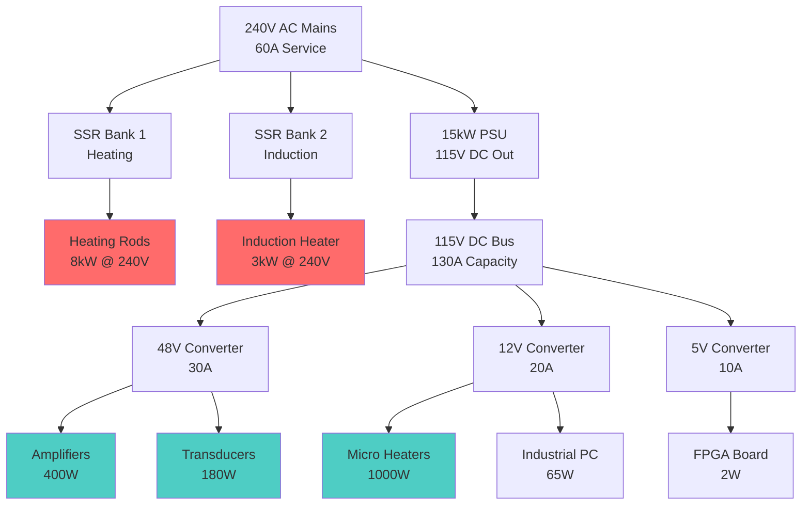

# Power Architecture Analysis

!!! warning "Architecture Update Required"
    System uses dual power domains - AC loads bypass the PSU entirely.
    
## Dual Domain Power Distribution

### AC Domain (Mains Direct)
**Total AC Load: 11000W**

| Component | Voltage | Power | Control Method |
|-----------|---------|-------|----------------|
| Heating Rods | 240V | 4000W | SSR |
| Heated Bed Assembly | 240V | 4000W | SSR |
| Induction Heater | 240V | 3000W | SSR |

### DC Domain (PSU Powered)
**Total DC Load: 4366W**

| Component | Voltage | Power | Source |
|-----------|---------|-------|--------|
| 40kHz Transducers | 48V | 180W | PSU |
| Transducer Array Layer | 48V | 5W | PSU |
| Pellet Hopper | 48V | 5W | PSU |
| Feedrate Controller | 48V | 10W | PSU |
| Temperature Controller | 48V | 3W | PSU |
| Micro Heaters | 12V | 1000W | PSU |
| Material Delivery System | 48V | 1000W | PSU |
| Thermal Pulse Formation | 48V | 50W | PSU |
| 15kW PSU | 48V | 1650W | PSU |
| FPGA Board | 5V | 2W | PSU |
| 6-Channel Amp Modules | 48V | 400W | PSU |
| 8-Channel Relays | 48V | 10W | PSU |
| STM32 Dev Board | 48V | 0W | PSU |
| Industrial PC | 12V | 0W | PSU |
| Thermal Camera - Optris Xi 400 | 48V | 16W | PSU |
| Emergency Stop System | 48V | 5W | PSU |
| Control Bus PCB | 48V | 10W | PSU |
| Acoustic Bus PCB | 48V | 5W | PSU |
| Thermal Bus PCB | 48V | 15W | PSU |

## PSU Utilization Analysis

- **PSU Model**: Mean Well RST-15K-115
- **PSU Capacity**: 15000W
- **DC Load**: 4366W  
- **Utilization**: 29.1%
- **Available Headroom**: 10634W

## Power Distribution Architecture

## Total System Power

- **AC Components**: 11000W
- **DC Components**: 4366W
- **PSU Input Power**: 4798W
- **Total Wall Power**: 15798W

## Electrical Service Requirements

### For AC Loads:
- 120V Circuits: 0W (0.0A)
- 240V Circuits: 11000W (45.8A)

### Recommended Configuration:
- One 240V 60A circuit for all loads
- Subpanel with:
  - 240V 30A breaker for heating (SSR controlled)
  - 240V 20A breaker for induction (SSR controlled)
  - 240V 20A breaker for PSU
  
## Component Control Architecture

### AC Components (SSR Controlled)
- Heating Rods: 4 × 1kW @ 240V → 4ch SSR module
- Heated Bed: Controlled via heating rods
- Induction Heater: 1 × 3kW @ 240V → High-power SSR

### DC Components (Direct Control)
- Transducers: PWM from amplifiers
- Amplifiers: Analog control from FPGA
- Micro Heaters: PWM from control board
- Logic: Direct power from converters

## Safety Considerations

### Protection Requirements
1. **AC Side**
   - GFCI protection on all heating circuits
   - Over-temperature cutouts on SSRs
   - Emergency stop disconnects AC power
   
2. **DC Side**
   - Overcurrent protection on each converter
   - Voltage monitoring on all rails
   - Soft-start circuits for capacitive loads

### Grounding Scheme
- AC ground and DC ground kept separate
- Single-point ground connection at PSU
- Shielded cables for high-frequency signals

## Cost Optimization

### Current Architecture Benefits
1. PSU correctly sized (not oversized for heating)
2. Efficient SSR control for AC loads
3. DC converters only for actual DC loads

### Estimated Component Costs
- 15kW PSU: $3,800
- SSR modules (8ch): ~$200
- DC-DC converters: ~$300
- Protection devices: ~$150
- **Total Power Control**: ~$4,450

## Recommendations

1. **Immediate Implementation**
   - Install appropriate SSRs for AC loads
   - Verify PSU is connected only to DC loads
   - Test emergency stop cuts both AC and DC

2. **Future Improvements**
   - Add power monitoring on both domains
   - Implement soft-start for heating elements
   - Consider phase angle control for finer heating control

3. **Safety Critical**
   - Never connect AC loads through the PSU
   - Ensure proper isolation between domains
   - Regular thermal imaging of power connections
