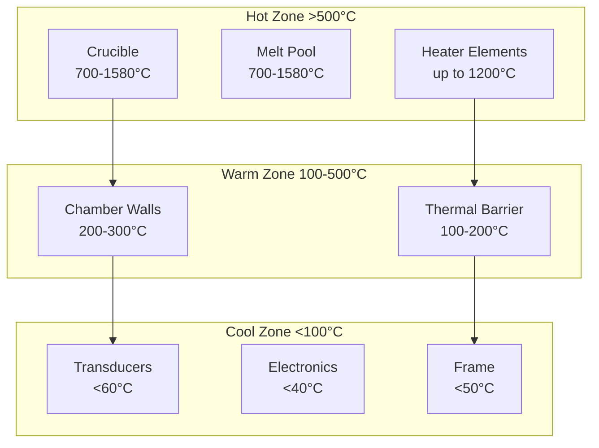

# Thermal Analysis

## Heat Budget

### Heat Generation Sources
- Induction heater: 3000W
- Resistive heaters: 8000W (4×2000W)
- Acoustic dissipation: 180W (18 transducers × 10W)
- PSU losses: 220W (3kW dual PSU @ 91% efficiency)

### Heat Removal Requirements
- Total heat load: 11,400W
- Required cooling capacity: 14.3kW (with 25% margin)
- Water flow rate: 5 L/min minimum
- Air flow: 600 CFM for electronics

## Thermal Zones

## Temperature Distribution

| Component | Operating Temp | Max Temp | Cooling Method |
|-----------|----------------|----------|----------------|
| Crucible | 700-1580°C | 2000°C | None (refractory) |
| Chamber | 200-300°C | 500°C | Passive + insulation |
| Transducers | 40°C | 60°C | Forced air |
| Electronics | 35°C | 70°C | Forced air |
| Frame | Ambient+10°C | 50°C | Passive |

## Thermal Management Strategy

### Active Cooling Systems
1. **Water Cooling Loop**
   - Flow rate: 5 L/min
   - Temperature rise: 10°C
   - Heat removal: 3.5kW
   - Components: Induction coil, chamber jacket

2. **Forced Air Cooling**
   - Total airflow: 600 CFM
   - Components: PSU, amplifiers, transducers
   - Heat removal: 2kW

### Passive Cooling
1. **Thermal Barriers**
   - Alumina ceramic: 10mm thick
   - Thermal resistance: 2.5 K/W
   - Max gradient: 100°C/mm

2. **Insulation**
   - Ceramic fiber: 50mm thick
   - Thermal conductivity: 0.1 W/m·K
   - Surface temperature: <50°C

## Thermal Simulation Results

### Steady-State Analysis
- Chamber wall: 250°C ± 20°C
- Transducer mounting: 45°C ± 5°C
- Electronics enclosure: 38°C ± 3°C
- Frame maximum: 42°C

### Transient Response
- Heatup time: 20 minutes to 1500°C
- Cooldown time: 45 minutes to 100°C
- Thermal cycling: 100 cycles tested
- No thermal stress failures

## Recommendations

1. **Critical Areas**
   - Monitor transducer temperature continuously
   - Add thermal fuse at 70°C for safety
   - Increase airflow if ambient >30°C

2. **Optimization Opportunities**
   - Add heat exchanger for 20% efficiency gain
   - Use waste heat for material preheating
   - Implement zone-based thermal control

3. **Future Improvements**
   - Closed-loop water cooling
   - Variable speed fans
   - Predictive thermal management
