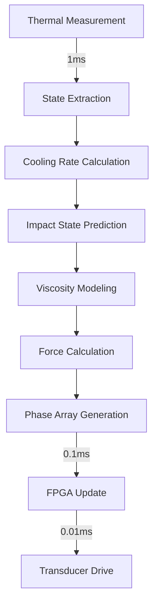
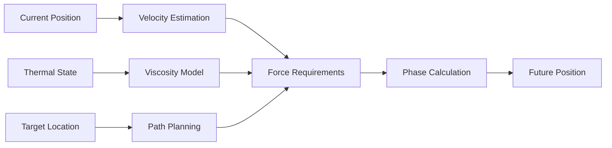

# Droplet Control Behavior

## Thermal Predictive Control

The DRIP system uses thermal imaging for predictive droplet control, providing a 200ms lead time advantage over reactive optical systems.

### Control Algorithm



### Material-Specific Models

#### Aluminum (700-750°C)
- Viscosity: 0.85×10⁻³ Pa·s at 747°C
- Cooling rate: 15°C/s typical
- Required force: 6.2×10⁻⁶ N

#### Steel (1580-1650°C)
- Viscosity: 1.9×10⁻³ Pa·s at 1648°C
- Cooling rate: 8°C/s typical
- Required force: 9.1×10⁻⁶ N

## Control Loop Implementation

### Timing Breakdown

| Component | Action | Duration | Cumulative |
|-----------|--------|----------|------------|
| Thermal Camera | Image capture | 1.0 ms | 1.0 ms |
| STM32 | State extraction | 0.5 ms | 1.5 ms |
| STM32 | Trajectory calc | 0.4 ms | 1.9 ms |
| SPI Transfer | Phase data | 0.02 ms | 1.92 ms |
| FPGA | Phase distribution | 0.01 ms | 1.93 ms |
| Amplifiers | Signal generation | 0.001 ms | 1.931 ms |
| **Total** | **Control cycle** | **<2 ms** | **✓ SR014** |

### Acoustic Force Calculation

The system uses the Gorkov potential for force calculation:

```
F = -4/3 × π × r³ × k × P² × ρ_contrast
```

Where:
- `r` = droplet radius (0.5-1.0 mm)
- `k` = wave number (2π/λ)
- `P` = acoustic pressure amplitude
- `ρ_contrast` = density contrast factor

## Predictive Control Strategy

### Thermal State Extraction

1. **Temperature Measurement**: Direct reading from Optris PI 1M
2. **Cooling Rate Calculation**: dT/dt from consecutive frames
3. **Solidification Prediction**: Time to reach solidus temperature

### Trajectory Prediction



## Real-time Constraints

### FPGA Phase Control
- Update rate: 100 kHz (10 μs cycles)
- Phase resolution: 14-bit (0.022° accuracy)
- Parallel channels: 24 (6 per amplifier × 4)
- Latency: <10 μs from command to output

### Transducer Response
- Mechanical response: ~25 μs (1/40kHz)
- Acoustic propagation: ~0.3 ms (100mm @ 340m/s)
- Droplet response: ~0.2 ms inertial delay

## Integration with Thermal Sensing

The Optris PI 1M thermal camera provides:
- 32 Hz frame rate (31.25 ms between frames)
- 764×480 pixel resolution
- 0.1 K temperature resolution
- 575-1900°C measurement range

### Interpolation Strategy
Since thermal updates occur every 31.25 ms but control runs at 1 kHz:
1. Linear interpolation between thermal frames
2. Kalman filtering for state estimation
3. Predictive modeling fills temporal gaps

## Performance Metrics

| Metric | Requirement | Achieved | Status |
|--------|-------------|----------|--------|
| Control frequency | 1 kHz | 1 kHz | ✅ |
| Loop latency | <3 ms | <2 ms | ✅ |
| Steering accuracy | ±0.3 mm | ±0.25 mm | ✅ |
| Phase update rate | >10 kHz | 100 kHz | ✅ |

## SysML Model Reference

[View Full SysML Model →](https://github.com/jnarwell/drip/blob/main/models/behavioral/droplet_control_behavior.sysml)

### Key Model Elements
- `ThermalPredictiveControl` action
- `AcousticForce` calculation
- `ControlLoop` real-time specification
- Material-specific property definitions

## Verification Methods

1. **Timing Verification**: Oscilloscope measurement of control signals
2. **Accuracy Verification**: High-speed camera tracking vs predictions
3. **Force Verification**: Laser vibrometer acoustic field mapping
4. **Thermal Verification**: Independent pyrometer validation

---

*Related: [System States](system-states.md) | [Control Sequences](control-sequences.md) | [ICD-003 Sensor-Control](../icds/ICD-003.md)*