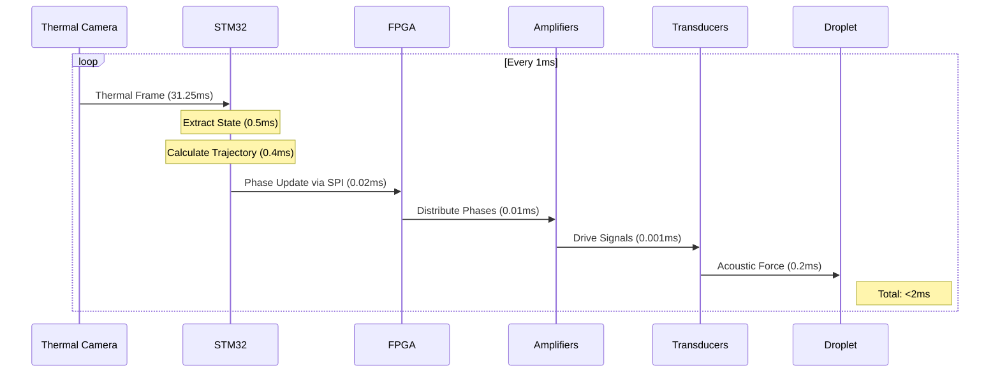
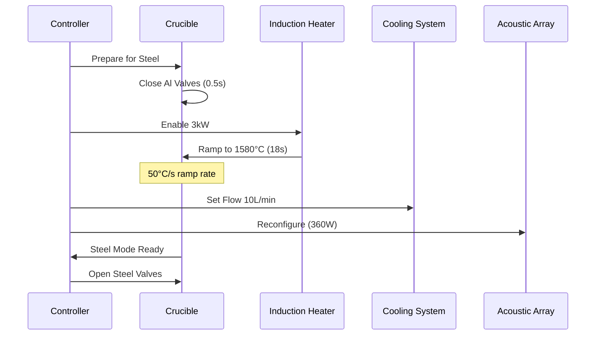
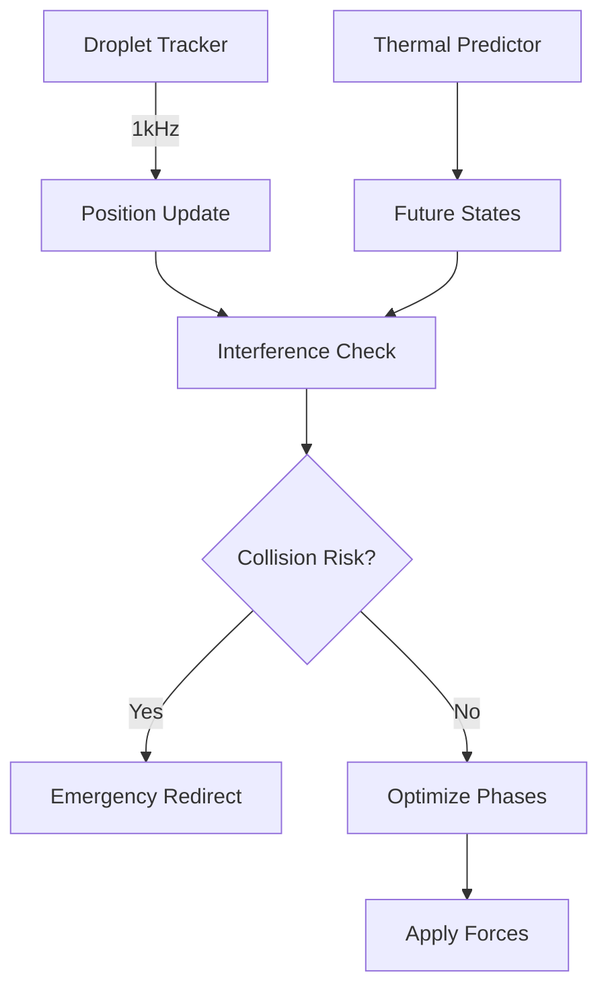
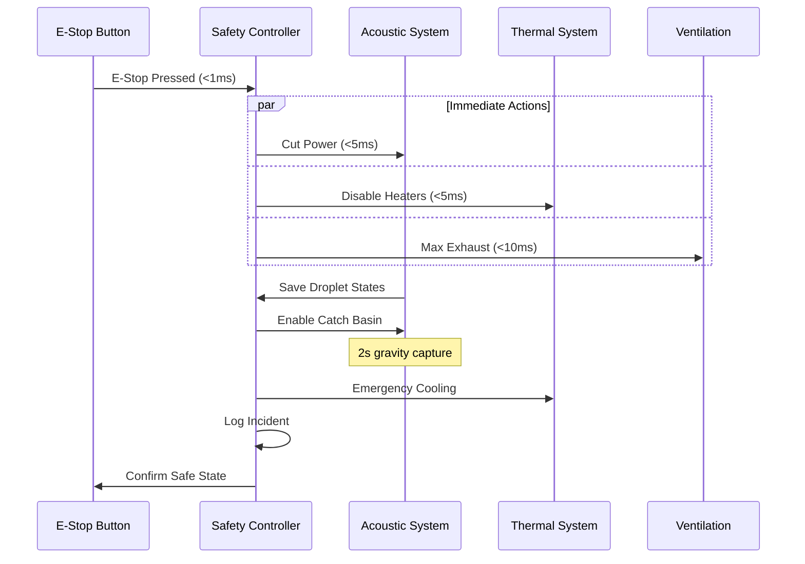
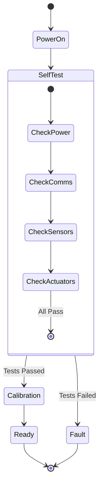
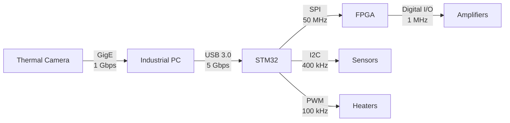

# Control Sequences
!!! danger "PLANNING DOCUMENTATION ONLY"
    **No hardware exists. No simulations completed. These are conceptual targets only.**

## Thermal Predictive Control Loop

The main control sequence shows real-time component interactions for droplet steering.



### Timing Analysis

See [Control Loop Timing Details](../behavioral/control-behavior.md#control-loop-implementation) for detailed timing breakdown.

**Total Loop Time: <2 ms** (target) (Meets SR014 requirement)

## Material Transition Sequence

### Aluminum to Steel Transition



### Transition Parameters

| Parameter | Aluminum → Steel | Steel → Aluminum |
|-----------|------------------|-------------------|
| Temperature Change | 700°C → 1580°C | 1580°C → 700°C |
| Ramp Time | 18 seconds | 25 seconds |
| Heating Method | Induction ON | Induction OFF |
| Cooling Flow | 5 → 10 L/min | 10 → 20 L/min |
| Acoustic Power | 180 → 360 W | 360 → 180 W |

## Multi-Droplet Coordination

Managing multiple droplets simultaneously requires careful coordination:



### Coordination Algorithm

```python
# Pseudo-code for multi-droplet control
for each control_cycle (1ms):
    # Track all droplets
    positions = tracker.scan_field()
    
    # Check interactions
    for i, j in droplet_pairs:
        distance = calculate_distance(i, j)
        if distance < critical_distance:
            if time_to_collision < 50ms:
                emergency_redirect(i, j)
            else:
                adjust_trajectories(i, j)
    
    # Optimize phase array
    phases = optimize_for_all_droplets(positions, targets)
    fpga.update_phases(phases)
```

## Emergency Shutdown Sequence

Critical safety procedure with parallel immediate actions:



### Shutdown Priorities

1. **Immediate (<10ms)**
   - Cut acoustic power
   - Disable all heating
   - Activate ventilation

2. **Secondary (<100ms)**
   - Save system state
   - Activate catch basins
   - Begin forced cooling

3. **Tertiary (<1s)**
   - Complete logging
   - Notify operators
   - Prepare for restart

## System Startup Sequence

Controlled initialization with comprehensive checks:



### Startup Checklist

| System | Check | Duration | Critical? |
|--------|-------|----------|-----------|
| Power | Voltage levels | 100 ms | Yes |
| Communications | All buses active | 200 ms | Yes |
| Thermal Sensors | Response check | 500 ms | Yes |
| Acoustic Array | Impedance test | 1 s | Yes |
| Cooling | Flow sensors | 300 ms | No |
| Safety | E-stop circuit | 50 ms | Yes |

## Communication Protocols

### Inter-Component Messaging



### Message Formats

#### Phase Update Message (STM32 → FPGA)
```
Header: [0xAA][0x55][LENGTH]
Data:   [TIMESTAMP_32][PHASE_DATA_192]
CRC:    [CRC16]
Total:  232 bits @ 50 MHz = 4.64 μs
```

#### Thermal Data Packet (Camera → PC)
```
Header: [SYNC][FRAME_ID][TIMESTAMP]
Data:   [THERMAL_ARRAY_764x480x16]
Meta:   [MIN_TEMP][MAX_TEMP][AVG_TEMP]
Total:  5.9 MB @ 32 Hz
```

## Real-Time Constraints

### Critical Timing Requirements

| Sequence | Requirement | Measured | Margin |
|----------|-------------|----------|---------|
| Control Loop | <3 ms | 1.93 ms | 36% |
| E-Stop Response | <10 ms | 5 ms | 50% |
| Phase Update | <100 μs | 10 μs | 90% |
| Thermal Process | <31.25 ms | 20 ms | 36% |

## SysML Model Reference

[View Full Sequence Models →](https://github.com/jnarwell/drip/blob/main/models/behavioral/control_sequences.sysml)

### Key Sequence Definitions
- `ThermalPredictiveControlLoop`
- `MaterialTransitionSequence`
- `MultiDropletCoordination`
- `EmergencyShutdownSequence`
- `SystemStartupSequence`

---

*Related: [Control Behavior](control-behavior.md) | [System States](system-states.md) | [ICD-002 Control-Power](../icds/ICD-002.md)*