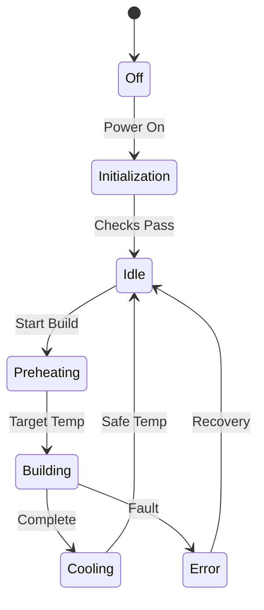
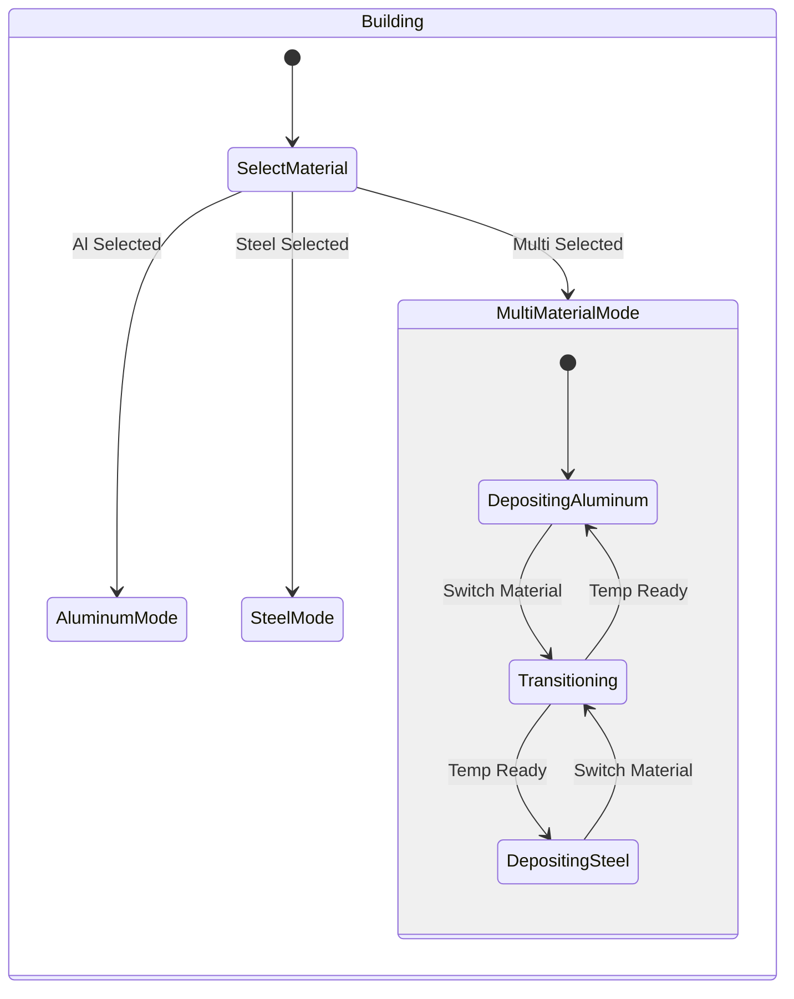
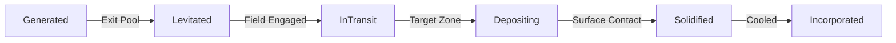
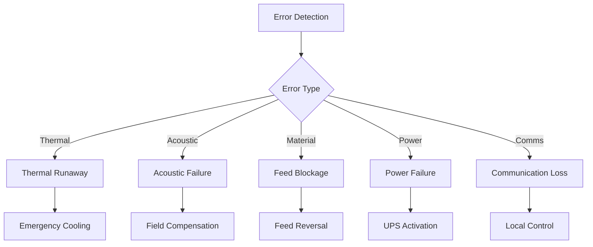

# System State Machines
!!! danger "PLANNING DOCUMENTATION ONLY"
    **No hardware exists. No simulations completed. These are conceptual targets only.**

## Operational States



## State Descriptions

### Off State
- All power disconnected
- System in safe configuration
- No active monitoring

### Initialization
- System self-diagnostics running
- Component health checks
- Communication verification
- Duration: ~30 seconds

### Idle (Operational)
- All systems powered and ready
- Active monitoring enabled
- Awaiting build commands
- Chamber at ambient temperature

### Preheating
- Crucible heating to target temperature
- Acoustic system calibration
- Build platform preparation
- Duration: 5-15 minutes (material dependent)

### Building
- Active droplet generation and deposition
- Real-time control loops engaged
- Thermal management active
- Multi-material transitions enabled

### Cooling
- Build complete, cooling to safe temperature
- Controlled cooldown to prevent thermal shock
- Maintains protective atmosphere
- Duration: 10-30 minutes

### Error States
- Fault detection and isolation
- Automatic recovery attempts
- Operator notification
- Safe system shutdown if needed

## Building Substates



### Material-Specific Parameters

#### Aluminum Mode
- Crucible: 700°C (±10°C)
- Acoustic Power: 180W
- Cooling Flow: 5 L/min
- Feed Rate: 0.5-2 g/min

#### Steel Mode
- Crucible: 1580°C (±20°C)
- Acoustic Power: 360W
- Cooling Flow: 10 L/min
- Induction Heating: Active
- Feed Rate: 0.3-1.5 g/min

## Droplet Lifecycle

Each droplet progresses through defined states from generation to solidification:



### State Timing Constraints

| State | Duration | Constraint |
|-------|----------|------------|
| Generated | <5 ms | Pool exit detection |
| Levitated | <10 ms | Field engagement |
| InTransit | <200 ms | Flight time limit |
| Depositing | <2 ms | Release control |
| Solidified | <50 ms | Cooling requirement |

## Error State Handling

### Error Categories



### Recovery Procedures

#### Thermal Runaway
1. Disable all heaters immediately
2. Maximize cooling flow
3. Open emergency vents
4. Monitor temperature decay
5. Log incident for analysis

#### Acoustic Failure
1. Identify failed transducer(s)
2. Reconfigure array compensation
3. Adjust power distribution
4. Continue with degraded performance
5. Schedule maintenance

#### Material Blockage
1. Stop feed motor
2. Reverse feed for 2 seconds
3. Attempt clearing cycle
4. If failed, require manual intervention
5. Adjust feed parameters

## State Transition Guards

### Critical Transitions

| From | To | Guard Condition |
|------|-----|-----------------|
| Preheating | Building | `crucibleTemp >= targetTemp - 5K` |
| Building | Cooling | `buildComplete == true` |
| Cooling | Idle | `maxTemp < 50°C` |
| Any | Error | `criticalFault == true` |
| Error | Idle | `recoveryComplete && systemSafe` |

## State Persistence

### Saved State Information
- Current operational state
- Material selection
- Temperature setpoints
- Build progress
- Error history
- Calibration data

### Recovery from Power Loss
1. Read persisted state
2. Verify system configuration
3. Check material status
4. Resume from safe state
5. Notify operator of status

## Monitoring and Logging

### State Change Events
```
timestamp: 2025-09-15T10:23:45.123Z
previous_state: Idle
new_state: Preheating
trigger: StartBuildCommand
parameters: {
    material: "Aluminum",
    target_temp: 700,
    build_file: "part_123.gcode"
}
```

### Health Monitoring
- State duration tracking
- Transition frequency analysis
- Error state statistics
- Performance metrics per state

## SysML Model Reference

[View Full State Model →](https://github.com/jnarwell/drip/blob/main/models/behavioral/system_states.sysml)

### Key Model Elements
- `DRIPSystemStates` top-level state machine
- `OperationalStates` substates
- `BuildingStates` material modes
- `DropletLifecycle` individual droplet states
- `ErrorStates` fault handling

---

*Related: [Control Behavior](control-behavior.md) | [Control Sequences](control-sequences.md) | [System Requirements](../system/requirements.md)*