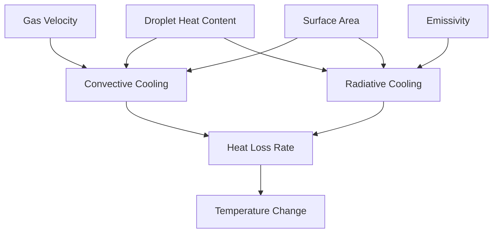
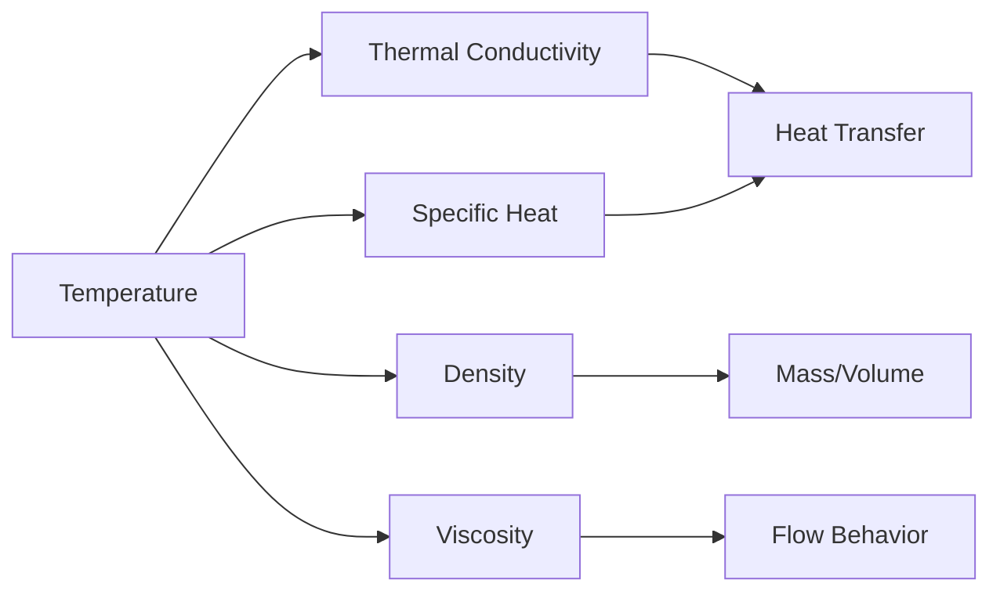
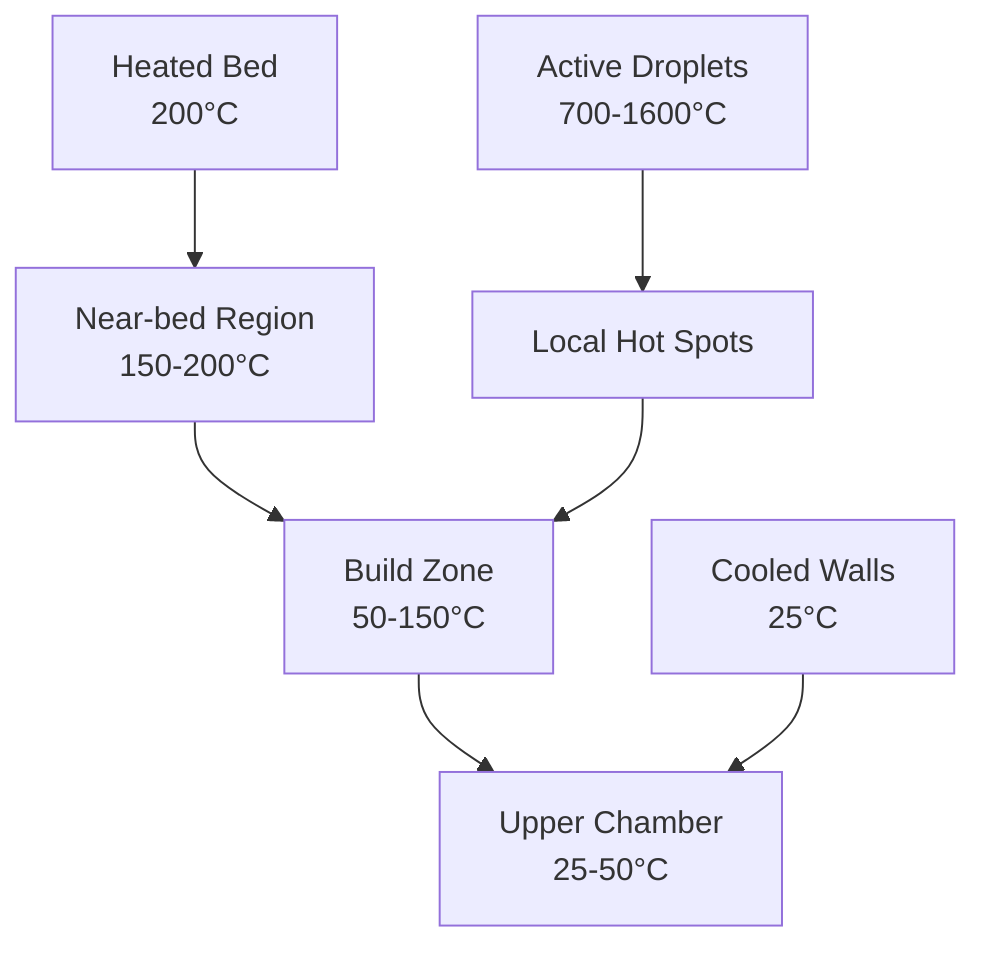
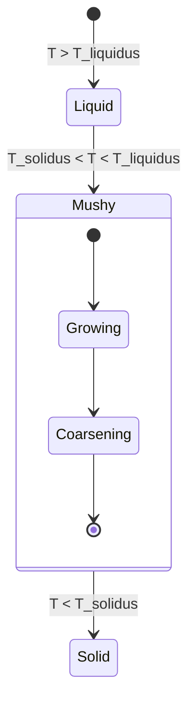
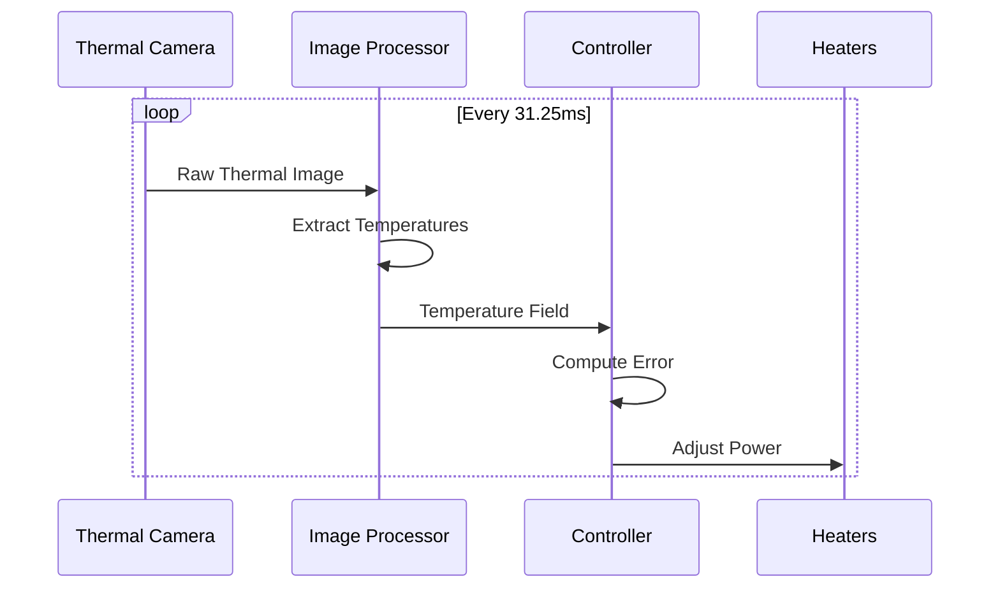

# Thermal Dynamics
!!! danger "PLANNING DOCUMENTATION ONLY"
    **No hardware exists. No simulations completed. These are conceptual targets only.**

## Droplet Cooling Model

The thermal behavior of droplets in flight determines solidification timing and microstructure formation.

### Heat Transfer Mechanisms



### Cooling Rate Equation

The total cooling rate combines Newton's law of cooling with Stefan-Boltzmann radiation:

```
dT/dt = -(h·A·(T-T_amb) + ε·σ·A·(T⁴-T_amb⁴))/(m·c_p)
```

Where:
- `h` = convection coefficient (W/m²·K)
- `A` = surface area (m²)
- `T` = droplet temperature (K)
- `T_amb` = ambient temperature (300 K)
- `ε` = emissivity (~0.3 for liquid metal)
- `σ` = Stefan-Boltzmann constant
- `m` = droplet mass (kg)
- `c_p` = specific heat (J/kg·K)

## Material-Specific Properties

### Temperature-Dependent Properties



### Material Comparison

| Property | Aluminum (700°C) | Steel (1600°C) |
|----------|------------------|-----------------|
| Density | 2375 kg/m³ | 7000 kg/m³ |
| Specific Heat | 1.18 kJ/kg·K | 0.75 kJ/kg·K |
| Thermal Conductivity | 90 W/m·K | 25 W/m·K |
| Dynamic Viscosity | 0.85 mPa·s | 1.9 mPa·s |
| Surface Tension | 0.914 N/m | 1.85 N/m |
| Emissivity | 0.3 | 0.35 |

## Cooling Rate Analysis

### Flight Time vs Temperature

```python
# Example cooling calculation for 1mm Al droplet
import numpy as np
import matplotlib.pyplot as plt

# Parameters
r = 0.5e-3  # radius (m)
T0 = 973    # initial temp (K)
T_amb = 300 # ambient (K)
t = np.linspace(0, 0.2, 1000)  # 200ms flight

# Simplified exponential cooling
tau = 0.05  # time constant (s)
T = T_amb + (T0 - T_amb) * np.exp(-t/tau)

# Cooling rate
dTdt = -(T0 - T_amb) / tau * np.exp(-t/tau)

plt.figure(figsize=(10, 5))
plt.subplot(121)
plt.plot(t*1000, T-273, 'b-')
plt.xlabel('Time (ms)')
plt.ylabel('Temperature (°C)')
plt.title('Droplet Temperature')

plt.subplot(122)
plt.plot(t*1000, -dTdt, 'r-')
plt.axhline(1000, color='g', linestyle='--', label='SR010 Requirement')
plt.xlabel('Time (ms)')
plt.ylabel('Cooling Rate (K/s)')
plt.title('Cooling Rate')
plt.legend()
plt.tight_layout()
```

### Results Summary

| Droplet Size | Material | Initial Temp | Flight Time | Final Temp | Avg Cooling Rate |
|--------------|----------|--------------|-------------|------------|------------------|
| 0.5 mm | Aluminum | 700°C | 100 ms | 450°C | 2500 K/s |
| 1.0 mm | Aluminum | 700°C | 200 ms | 400°C | 1500 K/s |
| 0.5 mm | Steel | 1600°C | 150 ms | 1200°C | 2667 K/s |
| 1.0 mm | Steel | 1600°C | 200 ms | 1150°C | 2250 K/s |

**All configurations exceed SR010 requirement of >1000 K/s** (target)

## Chamber Thermal Field

### 3D Temperature Distribution

The build chamber maintains controlled thermal gradients:



### Thermal Management Strategy

1. **Base Heating**: Maintain substrate temperature for adhesion
2. **Wall Cooling**: Prevent chamber overheating (SR009)
3. **Active Control**: Adjust based on build progress
4. **Gradient Control**: Minimize thermal stress

## Solidification Dynamics

### Phase Change Modeling



### Microstructure Prediction

Grain size correlates with cooling rate:
```
d = A × (dT/dt)^n
```
Where:
- `d` = average grain size
- `A` = material constant (~100 μm)
- `dT/dt` = cooling rate
- `n` = exponent (~-0.5)

### Predicted Microstructures

| Cooling Rate | Grain Size | Structure Type |
|--------------|------------|----------------|
| >10,000 K/s | <10 μm | Nanocrystalline |
| 1,000-10,000 K/s | 10-50 μm | Fine equiaxed |
| 100-1,000 K/s | 50-200 μm | Coarse equiaxed |
| <100 K/s | >200 μm | Columnar |

## Thermal Control Implementation

### Active Feedback Control

```python
class ThermalController:
    def __init__(self):
        self.Kp = 10.0   # Proportional gain
        self.Ki = 0.1    # Integral gain
        self.Kd = 1.0    # Derivative gain
        self.integral = 0
        self.last_error = 0
    
    def update(self, setpoint, measured, dt):
        error = setpoint - measured
        self.integral += error * dt
        derivative = (error - self.last_error) / dt
        
        output = (self.Kp * error + 
                 self.Ki * self.integral + 
                 self.Kd * derivative)
        
        self.last_error = error
        return output
```

### Zone-Based Heating

| Zone | Heater Type | Power | Control Method |
|------|-------------|-------|----------------|
| Bed Center | Cartridge | 4×500W | PID |
| Bed Edge | Silicone | 4×250W | PID |
| Crucible | Induction | 3000W | PID + Feedforward |
| Chamber | Radiant | 2×500W | On/Off |

## Thermal Imaging Integration

### Optris PI 1M Data Processing



### Temperature Field Analysis

1. **Spatial Resolution**: 764×480 pixels
2. **Temperature Resolution**: 0.1 K
3. **Frame Rate**: 32 Hz
4. **Processing Time**: <20 ms/frame

## Verification Metrics

| Parameter | Requirement | Method | Status |
|-----------|-------------|--------|--------|
| Cooling Rate | >1000 K/s | Pyrometer | (target) |
| Chamber Temp | <300°C | Thermocouples | (target) |
| Gradient | <50°C/cm | Thermal Imaging | (target) |
| Response Time | <100 ms | Step Response | (target) |

## SysML Model Reference

[View Full Thermal Model →](https://github.com/jnarwell/drip/blob/main/models/behavioral/thermal_dynamics.sysml)

### Key Model Elements
- `DropletCoolingModel` calculation
- `ThermalMaterialProperties` definitions
- `ChamberThermalField` analysis
- `SolidificationAnalysis` predictions
- `ThermalControlStrategy` actions

---

*Related: [Control Behavior](control-behavior.md) | [System Requirements](../system/requirements.md) | [ICD-001 Acoustic-Thermal](../icds/ICD-001.md)*