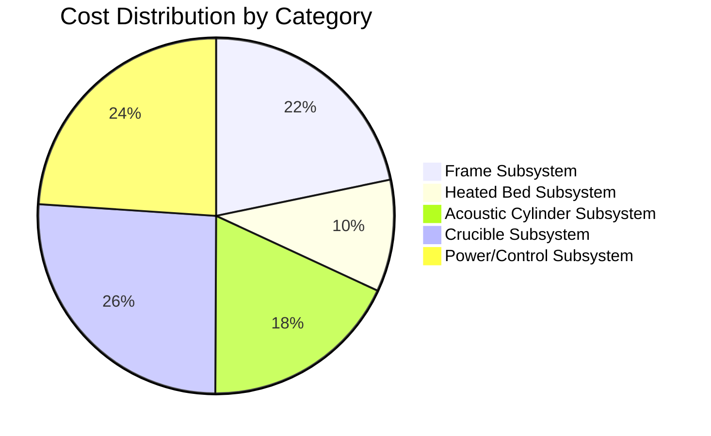

# Cost Analysis

## Cost Breakdown

## Top 10 Most Expensive Components

| Rank | Component | Cost | % of Total |
|------|-----------|------|------------|
| 1 | 10kW PSU | $1850.00 | 13.2% |
| 2 | Frame | $800.00 | 5.7% |
| 3 | Induction Heater | $700.00 | 5.0% |
| 4 | Build Volume | $600.00 | 4.3% |
| 5 | Acoustic Cylinder | $600.00 | 4.3% |
| 6 | Heated Bed Assembly | $450.00 | 3.2% |
| 7 | Transducer Rings | $450.00 | 3.2% |
| 8 | Baseplate | $400.00 | 2.9% |
| 9 | Transducer Array Layer | $400.00 | 2.9% |
| 10 | Crucible Assembly | $400.00 | 2.9% |

## Cost Metrics

- **Total System Cost**: $13,988.00
- **Average Component Cost**: $274.27
- **Most Expensive Category**: Crucible Subsystem
- **Least Expensive Category**: Heated Bed Subsystem
