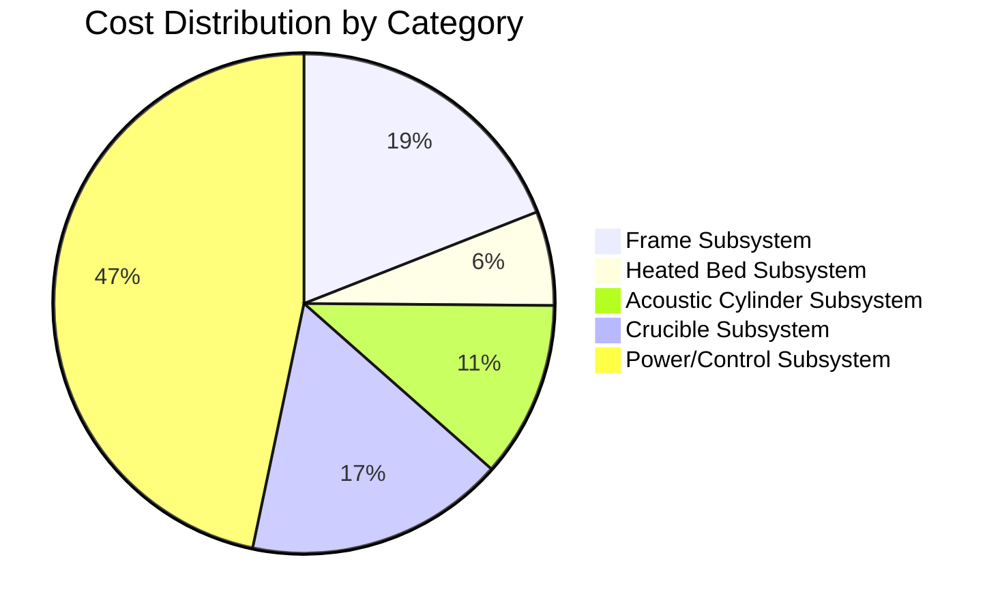

# Cost Analysis

## Cost Breakdown

## Top 10 Most Expensive Components

| Rank | Component | Cost | % of Total |
|------|-----------|------|------------|
| 1 | Thermal Camera - Optris Xi 400 | $8000.00 | 35.9% |
| 2 | Chamber Assembly | $1200.00 | 5.4% |
| 3 | Frame | $800.00 | 3.6% |
| 4 | Build Volume | $600.00 | 2.7% |
| 5 | Acoustic Cylinder | $600.00 | 2.7% |
| 6 | Copper Heated Bed | $450.00 | 2.0% |
| 7 | Transducer Rings | $450.00 | 2.0% |
| 8 | Induction Heater Module (OEM) | $420.00 | 1.9% |
| 9 | Baseplate | $400.00 | 1.8% |
| 10 | Transducer Array Layer | $400.00 | 1.8% |

## Cost Metrics

- **Total System Cost**: $22,276.00
- **Average Component Cost**: $318.23
- **Most Expensive Category**: Power/Control Subsystem
- **Least Expensive Category**: Heated Bed Subsystem
