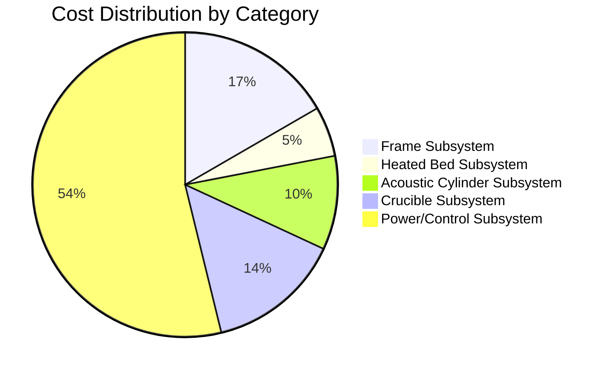

# Cost Analysis

## Cost Breakdown

## Top 10 Most Expensive Components

| Rank | Component | Cost | % of Total |
|------|-----------|------|------------|
| 1 | Thermal Camera - Optris Xi 400 | $8000.00 | 31.4% |
| 2 | 15kW PSU | $3800.00 | 14.9% |
| 3 | Chamber Assembly | $1200.00 | 4.7% |
| 4 | Frame | $800.00 | 3.1% |
| 5 | Induction Heater | $700.00 | 2.7% |
| 6 | Build Volume | $600.00 | 2.4% |
| 7 | Acoustic Cylinder | $600.00 | 2.4% |
| 8 | Copper Heated Bed | $450.00 | 1.8% |
| 9 | Transducer Rings | $450.00 | 1.8% |
| 10 | Baseplate | $400.00 | 1.6% |

## Cost Metrics

- **Total System Cost**: $25,485.00
- **Average Component Cost**: $439.40
- **Most Expensive Category**: Power/Control Subsystem
- **Least Expensive Category**: Heated Bed Subsystem
