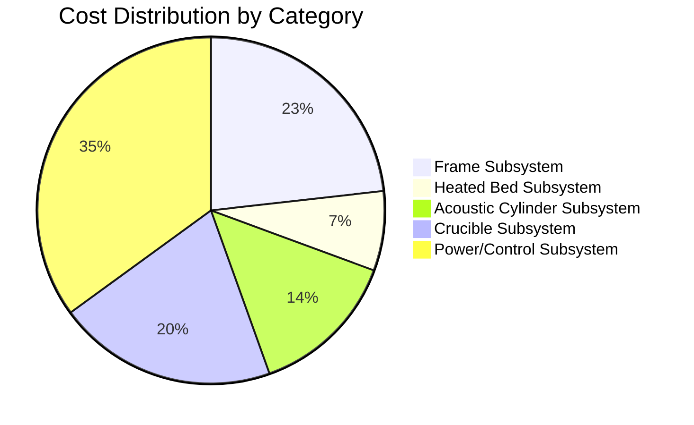

# Cost Analysis

## Cost Breakdown

## Top 10 Most Expensive Components

| Rank | Component | Cost | % of Total |
|------|-----------|------|------------|
| 1 | Thermal Camera - FLIR A35 | $3995.00 | 21.9% |
| 2 | Chamber Assembly | $1200.00 | 6.6% |
| 3 | Frame | $800.00 | 4.4% |
| 4 | Build Volume | $600.00 | 3.3% |
| 5 | Acoustic Cylinder | $600.00 | 3.3% |
| 6 | Copper Heated Bed | $450.00 | 2.5% |
| 7 | Transducer Rings | $450.00 | 2.5% |
| 8 | Induction Heater Module (OEM) | $420.00 | 2.3% |
| 9 | Baseplate | $400.00 | 2.2% |
| 10 | Transducer Array Layer | $400.00 | 2.2% |

## Cost Metrics

- **Total System Cost**: $18,271.00
- **Average Component Cost**: $261.01
- **Most Expensive Category**: Power/Control Subsystem
- **Least Expensive Category**: Heated Bed Subsystem
