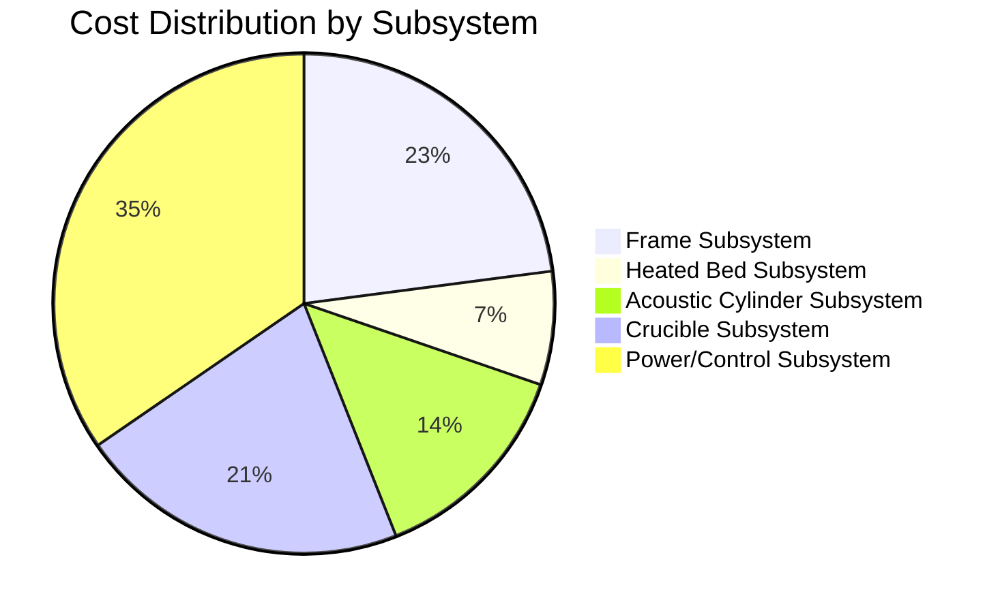
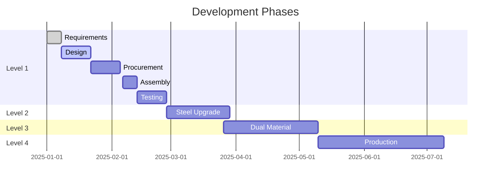

# System Dashboard

!!! warning "CONCEPTUAL PLANNING PHASE ONLY"
    **No hardware exists. No simulations completed. These are conceptual targets only.**

💰

<h3>Total Cost</h3>

$18,489

Level 1 System

🔧

<h3>Components</h3>

71

Total Parts

⚡

<h3>Power Budget</h3>

10.4kW

Net Consumption

🔌

<h3>Interfaces</h3>

5

ICDs Defined

## 📊 Subsystem Breakdown

## 🔋 Power Distribution

| Subsystem | Consumption | Supply | Net Power |
|-----------|-------------|--------|-----------|
| Heated Bed Subsystem | 6000W | 0W | 6000W |
| Acoustic Cylinder Subsystem | 185W | 0W | 185W |
| Crucible Subsystem | 5090W | 0W | 5090W |
| Power/Control Subsystem | 1170W | 2079W | -909W |
| **TOTAL** | **12444W** | **2079W** | **10365W** |

## 🔄 Development Timeline

## 📈 Test Progress

| Subsystem | Tests Planned | Tests Complete | Status |
|-----------|--------------|----------------|--------|
| Acoustic Array | 15 | 0 | 🔴 0% |
| Thermal System | 15 | 0 | 🔴 0% |
| Material Feed | 10 | 0 | 🔴 0% |
| Power System | 10 | 0 | 🔴 0% |
| Sensors | 10 | 0 | 🔴 0% |
| Control System | 10 | 0 | 🔴 0% |
| Chamber | 5 | 0 | 🔴 0% |
| Integration | 5 | 0 | 🔴 0% |
| Performance | 5 | 0 | 🔴 0% |
| Endurance | 10 | 0 | 🔴 0% |
| Validation | 5 | 0 | 🔴 0% |
| **TOTAL** | **100** | **0** | **🔴 0%** |

---
*Dashboard updated: 2025-09-23 10:28:13*
