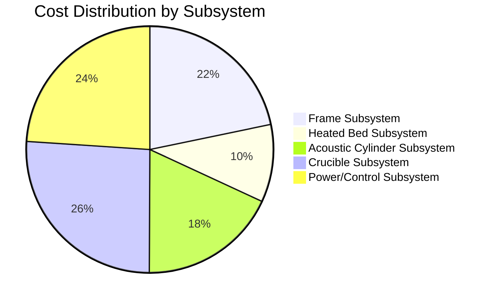
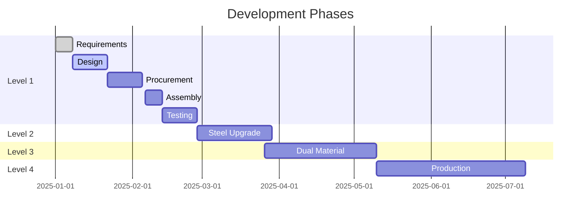

# System Dashboard

💰

<h3>Total Cost</h3>

$13,988

Level 1 System

🔧

<h3>Components</h3>

51

Total Parts

⚡

<h3>Power Budget</h3>

4.6kW

Net Consumption

🔌

<h3>Interfaces</h3>

5

ICDs Defined

## 📊 Subsystem Breakdown

## 🔋 Power Distribution

| Subsystem | Consumption | Supply | Net Power |
|-----------|-------------|--------|-----------|
| Heated Bed Subsystem | 8000W | 0W | 8000W |
| Acoustic Cylinder Subsystem | 185W | 0W | 185W |
| Crucible Subsystem | 5068W | 0W | 5068W |
| Power/Control Subsystem | 1342W | 10000W | -8658W |

| **TOTAL** | **14596W** | **10000W** | **4596W** |

## 🔄 Development Timeline

## 📈 Test Progress

| Subsystem | Tests Planned | Tests Complete | Status |
|-----------|--------------|----------------|--------|
| Acoustic Array | 8 | 6 | 🟡 75% |
| Thermal System | 6 | 4 | 🟡 67% |
| Control System | 5 | 5 | 🟢 100% |
| Material Feed | 4 | 2 | 🟠 50% |
| Integration | 3 | 0 | 🔴 0% |

---
*Dashboard updated: 2025-09-21 19:34:01*
