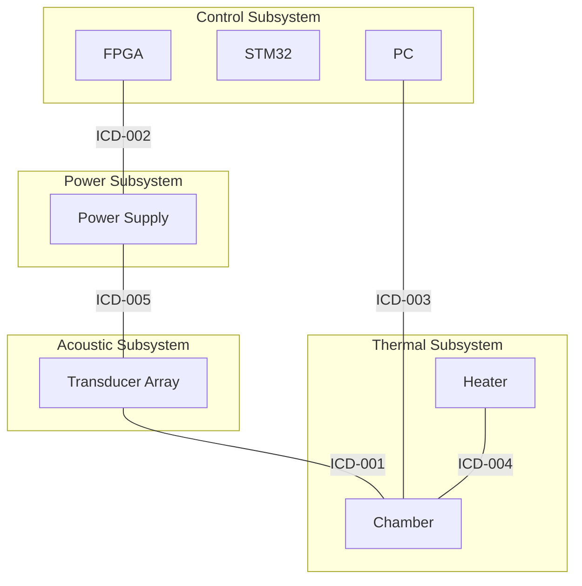

# Interface Control Documents

## Overview

Interface Control Documents (ICDs) define the boundaries between subsystems, ensuring proper integration and compatibility.

## Interface Matrix

## ICD Status

| ICD # | Interface | Criticality | Status | Last Updated |
|-------|-----------|-------------|--------|--------------|
| [ICD-001](ICD-001.md) | Acoustic-Thermal Interface | HIGH | Draft | 2025-09-23 |
| [ICD-002](ICD-002.md) | Control-Power Interface | HIGH | Draft | 2025-09-23 |
| [ICD-003](ICD-003.md) | Sensor-Control Interface | MEDIUM | Draft | 2025-09-23 |
| [ICD-004](ICD-004.md) | Induction-Crucible Interface | HIGH | Draft | 2025-09-23 |
| [ICD-005](ICD-005.md) | Amplifier-Transducer Interface | HIGH | Draft | 2025-09-23 |

## Interface Categories

### By Type
- **Mechanical**: Physical mounting and alignment
- **Electrical**: Power and signal connections
- **Thermal**: Heat transfer and isolation
- **Data**: Digital communication protocols
- **Acoustic**: Ultrasonic field interactions

### By Criticality
- **HIGH**: Failure affects system operation
- **MEDIUM**: Failure degrades performance
- **LOW**: Failure has minimal impact

## Validation Status

Current interface validation shows:
- 0 interfaces fully validated
- 5 interfaces with issues identified
- 10 total compatibility issues
- 6 warnings generated

See [Validation Report](validation.md) for details.
