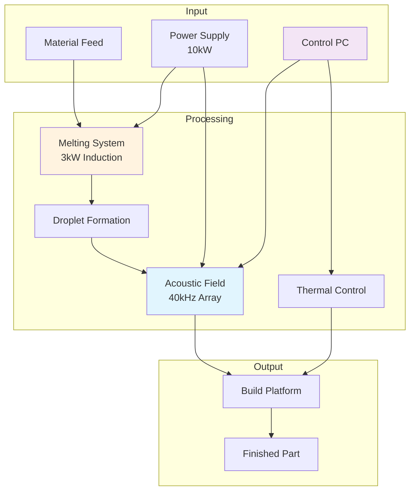
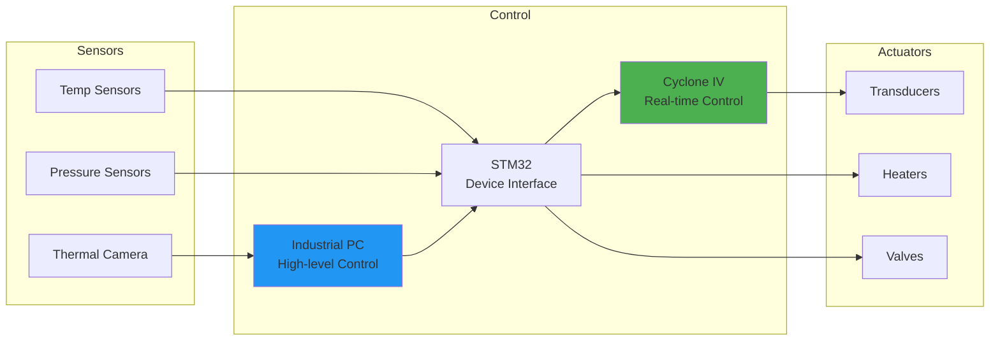

# System Architecture

## Overview

The Acoustic Manufacturing System uses ultrasonic steering to guide falling molten metal droplets for precise deposition control.

## System Block Diagram

## Subsystem Descriptions

### Acoustic Subsystem
- **Function**: Generate 40kHz acoustic fields for lateral droplet steering
- **Components**: 18-72 ultrasonic transducers in phased array
- **Control**: FPGA-based phase control with <100μs update rate
- **Power**: 180W (Level 1) to 720W (Level 4)

### Thermal Subsystem
- **Function**: Melt material and control solidification
- **Range**: 700-1580°C operating temperature
- **Heating**: 8kW resistive (Al) + 3kW induction (Steel)
- **Monitoring**: Optris PI 1M thermal camera at 32Hz

### Control Subsystem
- **Architecture**: Hierarchical (PC → STM32 → FPGA)
- **Loop Rate**: 1kHz primary control loop
- **Feedback**: Thermal imaging + acoustic field mapping
- **Interface**: Gigabit Ethernet + USB 3.0

### Power Subsystem
- **Capacity**: 10kW PSU with 91% efficiency
- **Distribution**: 48V primary, 24V/12V/5V secondary
- **Protection**: Over-current, over-temp, EMI filtering
- **Net Consumption**: 4.6kW (Level 1)

### Material Feed Subsystem
- **Capacity**: 25 parallel material outlets
- **Control**: Automated valve sequencing
- **Materials**: Al, Steel, Ti, Cu, Ni (Level 4)
- **Feed Rate**: Variable 0.1-10 g/min

## Data Flow Architecture

## Communication Protocols

| Interface | Protocol | Speed | Purpose |
|-----------|----------|-------|---------|
| PC ↔ Thermal Camera | Gigabit Ethernet | 1 Gbps | Thermal imaging |
| PC ↔ STM32 | USB 3.0 | 5 Gbps | Command/status |
| STM32 ↔ FPGA | SPI | 50 MHz | Real-time control |
| FPGA → Amplifiers | Digital I/O | 1 MHz | Phase control |
| STM32 → Heaters | PWM + I2C | 100 kHz | Temperature control |
