# System Architecture

## Interactive System Diagram

    <iframe 
        src="../assets/diagrams/system_architecture.html" 
        width="100%" 
        height="800px" 
        frameborder="0"
        loading="lazy">
    </iframe>

    <a href="../assets/diagrams/system_architecture.html" target="_blank" class="md-button md-button--primary">
        :material-open-in-new: Open Full Screen
    </a>
    <a href="../assets/images/system_architecture.png" download class="md-button">
        :material-download: Download PNG
    </a>

## System Overview Diagram

{ loading=lazy }

## Component Color Coding

Based on the system diagram, components are color-coded by type:

| Color | Type | Description | Examples |
|-------|------|-------------|----------|
| **Purple** 🟣 | Primary Subsystems | Major structural assemblies | Frame, Acoustic Cylinder, Heated Bed, Crucible |
| **Blue** 🔵 | Interface Layers | Subsystem interfaces | Thermal Isolation, Transducer Array Layer, Cooling Layer |
| **Red** 🔴 | Custom Components | Fabricated parts | Kapton Tubes, Air Gaps, Splitter Plate, Feed Lines |
| **Green** 🟢 | COTS Components | Commercial parts | Transducers, PSU, FPGA, Thermocouples |
| **Yellow** 🟡 | Control Signals | Data/control paths | Bus connections between components |

## System Connectivity Matrix

The following table shows the key connections between subsystems:

| From | To | Connection Type | Bus/Interface |
|------|-----|----------------|---------------|
| 10kW PSU | Acoustic Bus | Power | Green/Yellow |
| 10kW PSU | Control Bus | Power | Green/Yellow |
| 10kW PSU | Thermal Bus | Power | Green/Yellow |
| Acoustic Bus | Transducers (6x) | Power/Signal | Direct |
| Acoustic Bus | 6-Channel Amps (4x) | Signal | Direct |
| Control Bus | FPGA | Data | Bidirectional |
| FPGA | STM32 Custom PCB | Data | SPI/UART |
| STM32 | Industrial PC | Data | USB/CAN |
| Thermal Bus | Heating Rods (4x) | Power | Direct |
| Thermal Bus | Induction Heater | Power | Direct |
| Thermal Bus | Micro Heaters (25x) | Power | Relay-controlled |

## Detailed Component Connections

Based on the system architecture diagram, here are the detailed connections:

```mermaid
graph TB
    subgraph "Power Distribution"
        PSU[10kW PSU]
        PSU --> AB[Acoustic Bus]
        PSU --> CB[Control Bus]
        PSU --> TB[Thermal Bus]
    end
    
    subgraph "Control Hierarchy"
        CB --> FPGA
        FPGA <--> STM32[STM32 Custom PCB]
        STM32 <--> IPC[Industrial PC]
        IPC --> TC[Temperature Controller]
        IPC --> FR[Feedrate Controller]
    end
    
    subgraph "Acoustic Control"
        AB --> AMP[4× 6-Channel Amps]
        AMP --> TRANS[6× Transducers per Ring]
        FPGA --> AMP
    end
    
    subgraph "Thermal Control"
        TB --> HR[4× Heating Rods]
        TB --> IH[Induction Heater]
        TB --> MH[25× Micro Heaters]
        FPGA --> REL[5× 8-Channel Relays]
        REL --> MH
    end
    
    subgraph "Sensor Feedback"
        TH1[Thermocouples - Bed] --> STM32
        TH2[Thermocouples - Crucible] --> STM32
        STM32 --> TC
    end
```

## Subsystem Details

### Frame Subsystem
- **Main Structure**: SS tubes (1.5" OD) arranged in cubic configuration
- **Base Plate**: 10mm aluminum plate for stability
- **Top Plate**: 10mm aluminum with chamber access
- **Vibration Isolation**: Rubber dampeners at corners

### Acoustic Cylinder Subsystem
- **Chamber**: 120mm ID, 150mm OD, 300mm height
- **Transducer Rings**: 4 levels × 6 transducers per level
- **Cooling Layers**: Water-cooled aluminum jackets between rings
- **Air Gap**: 5mm isolation between cylinder and heated bed

### Heated Bed Subsystem
- **Platform**: 200mm × 200mm aluminum plate
- **Heating Elements**: 4× 500W cartridge heaters
- **Temperature Range**: Ambient to 250°C
- **Insulation**: Ceramic fiber board underneath

### Crucible Subsystem
- **Main Chamber**: Graphite crucible with 25 outlets
- **Induction Heating**: 2kW induction coil for melting
- **Feed System**: 25× micro heaters for individual control
- **Material Capacity**: 100ml aluminum/polymer

### Power & Control Subsystem
- **Main PSU**: 10kW industrial power supply
- **Distribution**: 3 isolated buses (Acoustic, Control, Thermal)
- **Control**: FPGA (Cyclone IV) → STM32F4 → Industrial PC
- **Amplifiers**: 4× 6-channel audio amplifiers
- **Relays**: 5× 8-channel relay boards

## Interface Control Documents (ICDs)

For detailed interface specifications, see:

- [ICD-001: Acoustic-Thermal Interface](../icds/ICD-001.md)
- [ICD-002: Control-Power Interface](../icds/ICD-002.md)
- [ICD-003: Mechanical-Thermal Interface](../icds/ICD-003.md)
- [ICD-004: Software-Hardware Interface](../icds/ICD-004.md)
- [ICD-005: Sensor-Control Interface](../icds/ICD-005.md)

## System Requirements Traceability

| Requirement | Subsystem | Implementation |
|-------------|-----------|----------------|
| Levitation Force | Acoustic | 24 transducers @ 40kHz |
| Temperature Control | Thermal | PID control via STM32 |
| Build Volume | Frame | 125mm³ working area |
| Material Feed | Crucible | 25 independent channels |
| Real-time Control | Control | FPGA @ 100kHz update rate |

## Communication Protocols

| Interface | Protocol | Speed | Purpose |
|-----------|----------|-------|---------|
| PC ↔ Thermal Camera | Gigabit Ethernet | 1 Gbps | Thermal imaging |
| PC ↔ STM32 | USB 3.0 | 5 Gbps | Command/status |
| STM32 ↔ FPGA | SPI | 50 MHz | Real-time control |
| FPGA → Amplifiers | Digital I/O | 1 MHz | Phase control |
| STM32 → Heaters | PWM + I2C | 100 kHz | Temperature control |

