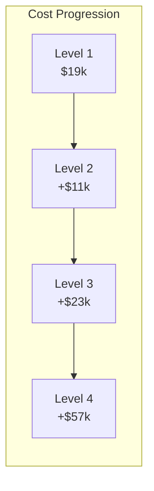

# Level Configurations
!!! danger "PLANNING DOCUMENTATION ONLY"
    **No hardware exists. No simulations completed. These are conceptual targets only.**

## Development Progression

The system follows a phased development approach with four distinct levels:

## Level Comparison

| Parameter | Level 1 | Level 2 | Level 3 | Level 4 |
|-----------|---------|---------|---------|---------|
| **Purpose** | Proof of Concept | Steel Capability | Multi-Material | Production |
| **Target Cost** | ~$19,139 | ~$29,665 | ~$52,249 | ~$109,092 |
| **Transducers** | 18 | 36 | 36 | 72 |
| **PSU Rating** | 1.5kW (DC only) | 3kW | 5kW | 8kW |
| **Total Power (AC/DC)** | 11kW/1.3kW | 19kW/3kW | 29kW/5kW | 43kW/8kW |
| **Chamber Size** | Ø120×150mm | Ø180×200mm | Ø180×200mm | Ø400×300mm |
| **Build Volume** | 125 cm³ | 1000 cm³ | 1000 cm³ | 8000 cm³ |
| **Materials** | Al | Al + Steel | Dual simultaneous | 5+ materials |
| **Target Build Rate** | 1 cm³/hr | 5 cm³/hr | 10 cm³/hr | 25 cm³/hr |
| **Outlets** | 25 | 100 | 100 | 400 |

## Level Details

=== "Level 1: Prototype"

    ### Objectives
    - Validate acoustic steering concept
    - Demonstrate aluminum processing
    - Achieve ±0.3mm positioning accuracy
    
    ### Key Components
    - 18× 40kHz transducers
    - Basic thermal monitoring
    - Manual material feed
    - Open-loop control
    
    ### Technical Specifications
    - **Acoustic Power**: 180W (18 × 10W)
    - **Heating Power**: 8kW resistive
    - **Control System**: STM32 + basic FPGA
    - **Thermal Monitoring**: Thermocouples only
    
    ### Target Success Criteria (Future Testing)
    - 📋 Consistent droplet steering for 30 minutes
    - 📋 Controlled deposition ±0.5mm
    - 📋 >95% density achievement
    - 📋 10 parts to be built for validation

=== "Level 2: Steel Capable"

    ### Objectives
    - Extend to 1580°C operation
    - Integrate induction heating
    - Closed-loop thermal control
    
    ### Key Components
    - 36× transducers (redundancy)
    - 3kW induction heater
    - FLIR A35 thermal camera
    - Water cooling system
    
    ### Technical Specifications
    - **Acoustic Power**: 360W (36 × 10W)
    - **Heating Power**: 8kW + 3kW induction
    - **Thermal Imaging**: 60Hz, 320×256 pixels
    - **Cooling**: 5 L/min water flow
    
    ### Target Success Criteria (Future Testing)
    - 📋 Steel melting capability demonstration
    - 📋 Thermal control ±10°C target
    - 📋 5 cm³/hr build rate goal
    - 📋 50 steel parts planned for validation

=== "Level 3: Multi-Material"

    ### Objectives
    - Simultaneous dual materials
    - Interface bonding control
    - Gradient structures
    
    ### Key Components
    - Dual feed systems
    - Interface monitoring
    - Advanced control algorithms
    - 2× thermal cameras
    
    ### Technical Specifications
    - **Material Switching**: <100ms
    - **Interface Resolution**: <0.1mm
    - **Gradient Control**: 10 steps/mm
    - **Bond Strength**: >70% base material
    
    ### Target Success Criteria (Future Testing)
    - 📋 Al-Steel bonding to be tested
    - 📋 Controlled mixing zones planned
    - 📋 Functionally graded parts goal
    - 📋 100 multi-material parts for validation

=== "Level 4: Production"

    ### Objectives
    - Industrial throughput
    - Automated operation
    - Quality certification
    
    ### Key Components
    - 72× transducers (6×12 array)
    - 400 parallel outlets
    - Full atmosphere control
    - Production software suite
    
    ### Technical Specifications
    - **Acoustic Power**: 720W (72 × 10W)
    - **Heating Power**: 15kW total
    - **Build Rate**: 25 cm³/hr
    - **Uptime**: >99% over 8 hours
    
    ### Target Success Criteria (Future Testing)
    - 📋 25 cm³/hr sustained rate goal
    - 📋 <$95/kg operating cost target
    - 📋 ISO 9001 certification planned
    - 📋 1000+ production parts for full validation

## Cost Breakdown by Level

## Technology Readiness

| Technology | L1 | L2 | L3 | L4 |
|------------|----|----|----|----|
| Acoustic Steering | TRL 6 | TRL 7 | TRL 8 | TRL 9 |
| Al Processing | TRL 5 | TRL 7 | TRL 8 | TRL 9 |
| Steel Processing | - | TRL 4 | TRL 6 | TRL 8 |
| Multi-Material | - | - | TRL 3 | TRL 6 |
| Production Software | TRL 3 | TRL 4 | TRL 5 | TRL 7 |
