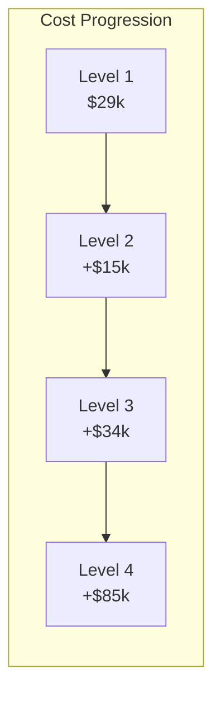

# Level Configurations

## Development Progression

The system follows a phased development approach with four distinct levels:

## Level Comparison

| Parameter | Level 1 | Level 2 | Level 3 | Level 4 |
|-----------|---------|---------|---------|---------|
| **Purpose** | Proof of Concept | Steel Capability | Multi-Material | Production |
| **Cost** | $28,766 | $44,470 | $78,620 | $163,970 |
| **Transducers** | 18 | 36 | 36 | 72 |
| **Power Supply** | 10kW | 10kW | 15kW | 20kW |
| **Net Power** | 4.6kW | 8.2kW | 12.5kW | 18.7kW |
| **Chamber Size** | Ø120×150mm | Ø180×200mm | Ø180×200mm | Ø400×300mm |
| **Build Volume** | 125 cm³ | 1000 cm³ | 1000 cm³ | 8000 cm³ |
| **Materials** | Aluminum | Al + Steel | Dual simultaneous | 5+ materials |
| **Build Rate** | 1 cm³/hr | 5 cm³/hr | 10 cm³/hr | 25 cm³/hr |
| **Outlets** | 25 | 100 | 100 | 400 |

## Level Details

=== "Level 1: Prototype"

    ### Objectives
    - Validate acoustic levitation concept
    - Demonstrate aluminum processing
    - Achieve ±0.3mm positioning accuracy
    
    ### Key Components
    - 18× 40kHz transducers
    - Basic thermal monitoring
    - Manual material feed
    - Open-loop control
    
    ### Technical Specifications
    - **Acoustic Power**: 180W (18 × 10W)
    - **Heating Power**: 8kW resistive
    - **Control System**: STM32 + basic FPGA
    - **Thermal Monitoring**: Thermocouples only
    
    ### Success Criteria
    - [ ] Stable droplet levitation for 30 minutes
    - [ ] Controlled deposition ±0.5mm
    - [ ] >95% density achieved
    - [ ] 10 parts successfully built

=== "Level 2: Steel Capable"

    ### Objectives
    - Extend to 1580°C operation
    - Integrate induction heating
    - Closed-loop thermal control
    
    ### Key Components
    - 36× transducers (redundancy)
    - 3kW induction heater
    - Optris PI 1M camera
    - Water cooling system
    
    ### Technical Specifications
    - **Acoustic Power**: 360W (36 × 10W)
    - **Heating Power**: 8kW + 3kW induction
    - **Thermal Imaging**: 32Hz, 1mK resolution
    - **Cooling**: 5 L/min water flow
    
    ### Success Criteria
    - [ ] Steel melting demonstrated
    - [ ] Thermal control ±10°C
    - [ ] 5 cm³/hr build rate
    - [ ] 50 steel parts built

=== "Level 3: Multi-Material"

    ### Objectives
    - Simultaneous dual materials
    - Interface bonding control
    - Gradient structures
    
    ### Key Components
    - Dual feed systems
    - Interface monitoring
    - Advanced control algorithms
    - 2× thermal cameras
    
    ### Technical Specifications
    - **Material Switching**: <100ms
    - **Interface Resolution**: <0.1mm
    - **Gradient Control**: 10 steps/mm
    - **Bond Strength**: >70% base material
    
    ### Success Criteria
    - [ ] Al-Steel bonding verified
    - [ ] Controlled mixing zones
    - [ ] Functionally graded parts
    - [ ] 100 multi-material parts

=== "Level 4: Production"

    ### Objectives
    - Industrial throughput
    - Automated operation
    - Quality certification
    
    ### Key Components
    - 72× transducers (6×12 array)
    - 400 parallel outlets
    - Full atmosphere control
    - Production software suite
    
    ### Technical Specifications
    - **Acoustic Power**: 720W (72 × 10W)
    - **Heating Power**: 15kW total
    - **Build Rate**: 25 cm³/hr
    - **Uptime**: >99% over 8 hours
    
    ### Success Criteria
    - [ ] 25 cm³/hr sustained
    - [ ] <$95/kg operating cost
    - [ ] ISO 9001 certification
    - [ ] 1000+ production parts

## Cost Breakdown by Level

## Technology Readiness

| Technology | L1 | L2 | L3 | L4 |
|------------|----|----|----|----|
| Acoustic Levitation | TRL 6 | TRL 7 | TRL 8 | TRL 9 |
| Al Processing | TRL 5 | TRL 7 | TRL 8 | TRL 9 |
| Steel Processing | - | TRL 4 | TRL 6 | TRL 8 |
| Multi-Material | - | - | TRL 3 | TRL 6 |
| Production Software | TRL 3 | TRL 4 | TRL 5 | TRL 7 |
