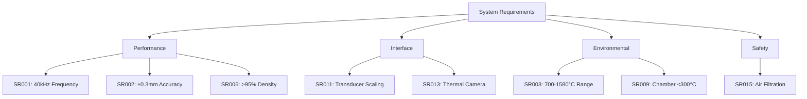

# System Requirements
!!! danger "PLANNING DOCUMENTATION ONLY"
    **No hardware exists. No simulations completed. These are conceptual targets only.**

## Requirement Hierarchy

## Requirements Verification Planning

| ID | Requirement | Verification Method | Status | Test Ref |
|----|-------------|-------------------|--------|----------|
| SR001 | 40kHz ±100Hz acoustic frequency | Spectrum analysis | 📋 Planned | TP-001 |
| SR002 | ±0.3-0.5mm steering accuracy | Optical tracking | 📋 Planned | TP-002 |
| SR003 | 700-1580°C temperature range | Thermocouple | 📋 Planned | TP-003 |
| SR004 | Power scaling 12-45kW | Power meter | 📋 Planned | TP-004 |
| SR005 | Build volume 125-8000cm³ | CMM measurement | 📋 Planned | TP-005 |
| SR006 | >95% material density | Archimedes | 📋 Planned | TP-006 |
| SR007 | 25 cm³/hr build rate (L4) | Volumetric | 📋 Planned | TP-007 |
| SR008 | <$95/kg operating cost | Cost analysis | 📋 Planned | TP-008 |
| SR009 | Chamber temp <300°C | Thermal mapping | 📋 Planned | TP-009 |
| SR010 | >1000°C/s cooling rate | Pyrometer | 📋 Planned | TP-010 |
| SR011 | Scalable transducer array | Field mapping | 📋 Planned | TP-011 |
| SR012 | 25 parallel outlets | Visual inspection | 📋 Planned | TP-012 |
| SR013 | Thermal camera integration | Latency test | 📋 Planned | TP-013 |
| SR014 | FPGA control architecture | Logic analyzer | 📋 Planned | TP-014 |
| SR015 | MERV 13 air filtration | Flow measurement | 📋 Planned | TP-015 |

## Verification Planning Status

**Current Status: Planning Phase**

- 📋 All Requirements: 15 requirements (100%)
- 🎯 Verification Method Defined: 15 requirements (100%)
- ⏳ Awaiting Hardware: 15 requirements (100%)
- 🔬 Awaiting Simulation Tools: 15 requirements (100%)

**Note:** No verification activities can begin until prototype hardware is assembled and simulation tools are acquired.

## Target Performance Requirements (Unvalidated)

### Acoustic Performance Targets
- **Frequency**: 40 kHz ± 100 Hz (target)
- **Power**: ~10W per transducer (estimated)
- **Array Size**: 18 (L1) to 72 (L4) transducers (planned)
- **Field Uniformity**: ±5% across build volume (goal)

### Thermal Performance Targets
- **Melt Temperature**: 700°C (Al) to 1580°C (Steel) (planned capability)
- **Temperature Stability**: ±10°C (target)
- **Cooling Rate**: >1000°C/s (theoretical target)
- **Thermal Gradient**: <50°C/cm in build zone (design goal)

### Material Quality Targets
- **Density**: >95% theoretical (aspirational goal)
- **Surface Finish**: <50 μm Ra (target)
- **Dimensional Accuracy**: ±0.5mm (design target)
- **Microstructure**: Controlled grain size (research goal)

### System Capacity Targets
- **Build Volume**: 125 cm³ (L1) to 8000 cm³ (L4) (planned)
- **Build Rate**: 1 cm³/hr (L1) to 25 cm³/hr (L4) (estimated)
- **Material Range**: Al, Steel, Ti, Cu, Ni (proposed)
- **Uptime**: >90% over 8 hours (operational goal)
