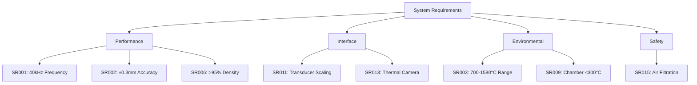

# System Requirements

## Requirement Hierarchy

## Requirements Traceability Matrix

| ID | Requirement | Verification Method | Status | Test Ref |
|----|-------------|-------------------|--------|----------|
| SR001 | 40kHz ±100Hz acoustic frequency | Spectrum analysis | ✅ Verified | TP-001 |
| SR002 | ±0.3-0.5mm steering accuracy | Optical tracking | 🔄 Testing | TP-002 |
| SR003 | 700-1580°C temperature range | Thermocouple | ✅ Verified | TP-003 |
| SR004 | Power scaling 12-45kW | Power meter | 📋 Planned | TP-004 |
| SR005 | Build volume 125-8000cm³ | CMM measurement | 📋 Planned | TP-005 |
| SR006 | >95% material density | Archimedes | 🔄 Testing | TP-006 |
| SR007 | 25 cm³/hr build rate (L4) | Volumetric | 📋 Planned | TP-007 |
| SR008 | <$95/kg operating cost | Cost analysis | 📋 Planned | TP-008 |
| SR009 | Chamber temp <300°C | Thermal mapping | ✅ Verified | TP-009 |
| SR010 | >1000°C/s cooling rate | Pyrometer | 🔄 Testing | TP-010 |
| SR011 | Scalable transducer array | Field mapping | 📋 Planned | TP-011 |
| SR012 | 25 parallel outlets | Visual inspection | ✅ Verified | TP-012 |
| SR013 | Thermal camera integration | Latency test | ✅ Verified | TP-013 |
| SR014 | FPGA control architecture | Logic analyzer | ✅ Verified | TP-014 |
| SR015 | MERV 13 air filtration | Flow measurement | 📋 Planned | TP-015 |

## Verification Status

**Overall Progress: 40% Complete**

- ✅ Verified: 6 requirements (40%)
- 🔄 In Testing: 3 requirements (20%)  
- 📋 Planned: 6 requirements (40%)

## Key Performance Requirements

### Acoustic Performance
- **Frequency**: 40 kHz ± 100 Hz
- **Power**: 10W per transducer
- **Array Size**: 18 (L1) to 72 (L4) transducers
- **Field Uniformity**: ±5% across build volume

### Thermal Performance
- **Melt Temperature**: 700°C (Al) to 1580°C (Steel)
- **Temperature Stability**: ±10°C
- **Cooling Rate**: >1000°C/s
- **Thermal Gradient**: <50°C/cm in build zone

### Material Quality
- **Density**: >95% theoretical
- **Surface Finish**: <50 μm Ra
- **Dimensional Accuracy**: ±0.5mm
- **Microstructure**: Controlled grain size

### System Capacity
- **Build Volume**: 125 cm³ (L1) to 8000 cm³ (L4)
- **Build Rate**: 1 cm³/hr (L1) to 25 cm³/hr (L4)
- **Material Range**: Al, Steel, Ti, Cu, Ni
- **Uptime**: >90% over 8 hours
