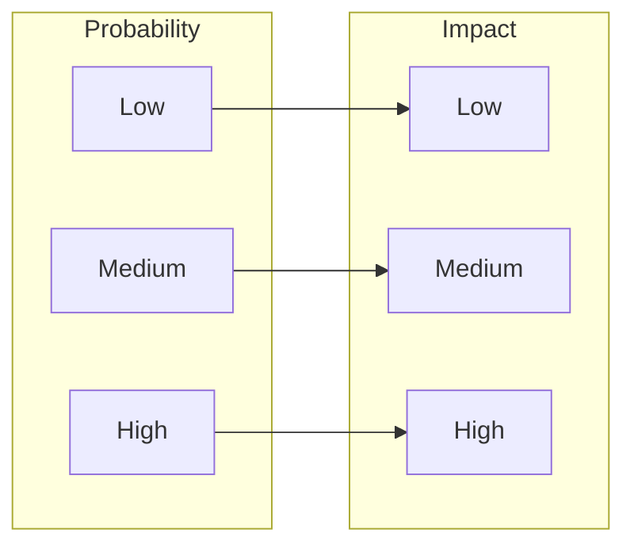

# Risk Analysis

## Risk Matrix

## Identified Risks

### Technical Risks

| Risk ID | Description | Probability | Impact | Mitigation |
|---------|-------------|-------------|--------|------------|
| TR-001 | Acoustic field instability | Medium | High | Redundant transducers, feedback control |
| TR-002 | Thermal gradient too steep | Medium | Medium | Active cooling, zone control |
| TR-003 | Material contamination | Low | High | Inert atmosphere, filtration |
| TR-004 | Control system latency | Low | Medium | FPGA optimization, parallel processing |
| TR-005 | Power supply failure | Low | High | UPS backup, redundant PSU |

### Project Risks

| Risk ID | Description | Probability | Impact | Mitigation |
|---------|-------------|-------------|--------|------------|
| PR-001 | Component lead times | High | Medium | Early ordering, alternative suppliers |
| PR-002 | Budget overrun | Medium | Medium | 20% contingency, phased procurement |
| PR-003 | Schedule delay | Medium | Low | Parallel development tracks |
| PR-004 | Key personnel loss | Low | High | Documentation, cross-training |
| PR-005 | Regulatory compliance | Low | Medium | Early engagement with authorities |

### Safety Risks

| Risk ID | Description | Probability | Impact | Mitigation |
|---------|-------------|-------------|--------|------------|
| SR-001 | High temperature exposure | Medium | High | Interlocks, barriers, PPE |
| SR-002 | Ultrasonic exposure | Medium | Medium | Enclosure, exposure limits |
| SR-003 | Electrical hazard | Low | High | GFCI, isolation, lockout/tagout |
| SR-004 | Material fumes | Medium | Medium | Ventilation, air filtration |
| SR-005 | Fire hazard | Low | High | Fire suppression, emergency stops |

## Risk Response Strategy

### High Priority Risks (Red Zone)
- **Immediate Action Required**
- Weekly monitoring
- Dedicated mitigation resources
- Executive visibility

### Medium Priority Risks (Yellow Zone)
- **Active Management**
- Bi-weekly review
- Mitigation plans in place
- Regular status updates

### Low Priority Risks (Green Zone)
- **Monitor Only**
- Monthly review
- Contingency plans documented
- Trigger points defined

## Contingency Plans

### Technical Contingencies
1. **Acoustic System Failure**
   - Spare transducers on hand (20% extra)
   - Alternative array configurations tested
   - Manual override capability

2. **Thermal System Issues**
   - Backup heating elements
   - Secondary cooling loop
   - Temperature limit overrides

### Schedule Contingencies
1. **Component Delays**
   - Alternative suppliers identified
   - Critical parts ordered early
   - Parallel assembly paths

2. **Testing Delays**
   - Extended hours approved
   - External test facilities identified
   - Reduced scope options

### Budget Contingencies
1. **Cost Overruns**
   - 20% contingency allocated
   - Phased implementation option
   - Scope reduction plan

## Risk Monitoring

Monthly risk review meetings include:
- Risk register updates
- Mitigation effectiveness
- New risk identification
- Action item tracking

**Risk Metrics Dashboard**:
- Active risks by category
- Mitigation completion %
- Risk trend analysis
- Cost/schedule impact
