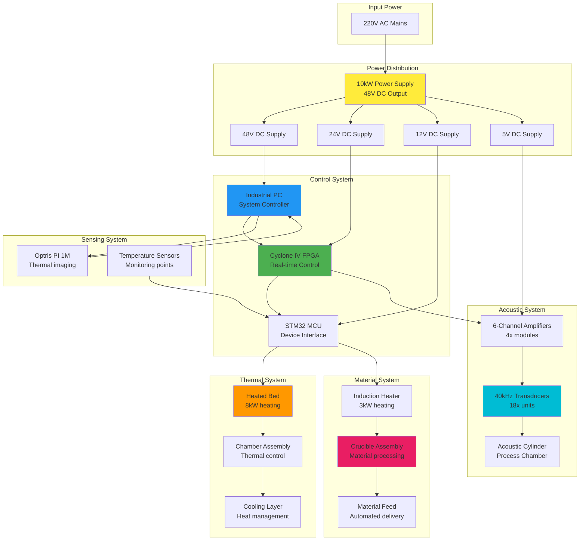

# System Block Diagram

```mermaid
flowchart TB
    subgraph "Input Power"
        AC[220V AC Mains]
    end
    
    subgraph "Power Distribution"
        PSU[10kW Power Supply<br/>48V DC Output]
        PSU48[48V DC Supply]
        PSU24[24V DC Supply] 
        PSU12[12V DC Supply]
        PSU5[5V DC Supply]
    end
    
    subgraph "Control System"
        PC[Industrial PC<br/>System Controller]
        FPGA[Cyclone IV FPGA<br/>Real-time Control]
        STM32[STM32 MCU<br/>Device Interface]
    end
    
    subgraph "Acoustic System"
        AMP[6-Channel Amplifiers<br/>4x modules]
        TRANS[40kHz Transducers<br/>18x units]
        CYL[Acoustic Cylinder<br/>Process Chamber]
    end
    
    subgraph "Thermal System"
        BED[Heated Bed<br/>8kW heating]
        CHAMBER[Chamber Assembly<br/>Thermal control]
        COOL[Cooling Layer<br/>Heat management]
    end
    
    subgraph "Material System"
        CRUCIBLE[Crucible Assembly<br/>Material processing]
        INDUCTION[Induction Heater<br/>3kW heating]
        FEED[Material Feed<br/>Automated delivery]
    end
    
    subgraph "Sensing System"
        THERMAL_CAM[Optris PI 1M<br/>Thermal imaging]
        TEMP_SENS[Temperature Sensors<br/>Monitoring points]
    end
    
    AC --> PSU
    PSU --> PSU48
    PSU --> PSU24
    PSU --> PSU12
    PSU --> PSU5
    
    PSU48 --> PC
    PSU24 --> FPGA
    PSU12 --> STM32
    PSU5 --> AMP
    
    PC --> FPGA
    FPGA --> STM32
    PC --> THERMAL_CAM
    
    FPGA --> AMP
    AMP --> TRANS
    TRANS --> CYL
    
    STM32 --> BED
    BED --> CHAMBER
    CHAMBER --> COOL
    
    STM32 --> INDUCTION
    INDUCTION --> CRUCIBLE
    CRUCIBLE --> FEED
    
    THERMAL_CAM --> PC
    TEMP_SENS --> STM32
    
    style PSU fill:#ffeb3b
    style PC fill:#2196f3
    style FPGA fill:#4caf50
    style TRANS fill:#00bcd4
    style BED fill:#ff9800
    style CRUCIBLE fill:#e91e63
```
