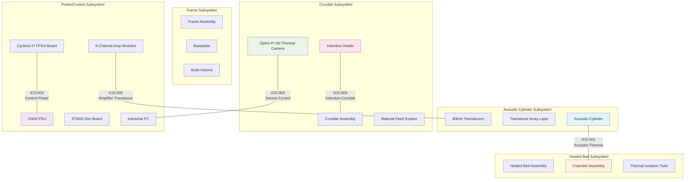

# N2 Interface Chart

This diagram shows the interface relationships between major subsystems.

## Interface Legend

- **ICD-001**: Acoustic-Thermal Interface (HIGH criticality)
- **ICD-002**: Control-Power Interface (HIGH criticality)  
- **ICD-003**: Sensor-Control Interface (MEDIUM criticality)
- **ICD-004**: Induction-Crucible Interface (HIGH criticality)
- **ICD-005**: Amplifier-Transducer Interface (HIGH criticality)
