# Team Organization

## Overview

The DRIP (Drop Resonance Induction Printing) project requires a cross-functional team of Stanford students with diverse engineering expertise. This section provides resources for team organization, role definition, and project coordination.

## Team Structure

The project is organized around five key engineering roles, each responsible for specific subsystems and deliverables:

### Core Team Roles

1. **[Mechanical/Systems Lead](structure.md#mechanicalsystems-lead)**
   - System architecture and integration
   - Frame and chamber design
   - Test campaign management

2. **[Thermal/Materials Engineer](structure.md#thermalmaterials-engineer)**
   - Thermal system design
   - Crucible and melting systems
   - Material compatibility

3. **[Power/Electronics Engineer](structure.md#powerelectronics-engineer)**
   - Power distribution (10kW system)
   - PCB design and safety systems
   - EMI/EMC compliance

4. **[Acoustics/Control Engineer](structure.md#acousticscontrol-engineer)**
   - Acoustic field modeling
   - FPGA/software development
   - Real-time control systems

5. **[UX/Industrial Designer](structure.md#uxindustrial-designer)**
   - Industrial design
   - User interfaces
   - Documentation and visualization

## Interactive Team Page

Access our **[Interactive Team Structure Page](../../team-page/index.html)** to:

- View detailed role responsibilities and requirements
- Track team member assignments
- Access Stanford resource information
- Export team data for documentation

!!! tip "Team Page Features"
    - Auto-saves all entered information
    - Mobile-friendly responsive design
    - Export to PDF, text, or JSON formats
    - Search and filter capabilities

## Project Phases

### Current Status: Design & Planning Phase

The project follows a structured development approach:

```mermaid
gantt
    title DRIP Development Phases
    dateFormat X
    axisFormat %s
    
    section Development
    Requirements & Design    :done, req, 0, 4w
    Procurement             :active, proc, after req, 4w
    Integration & Assembly  :integ, after proc, 4w
    Testing & Validation    :test, after integ, 4w
```

## Stanford Resources

The team has access to extensive Stanford facilities:

### Primary Labs
- **Product Realization Lab (PRL)**: CNC, waterjet, 3D printing
- **Mechanical Testing Lab**: Instron, vibration testing
- **EE Shop**: PCB fabrication and assembly
- **Thermal Labs**: High-temperature testing to 1600°C

### Software Tools
- COMSOL Multiphysics
- ANSYS Mechanical/Fluent
- SolidWorks/Fusion 360
- Altium Designer
- MATLAB/Simulink

## Communication & Coordination

### Weekly Meetings
- **Team Sync**: Mondays 6:00 PM
- **Technical Reviews**: Wednesdays 4:00 PM
- **Lab Time**: Fridays 2:00-6:00 PM

### Documentation Standards
- All design files in project repository
- Weekly progress updates
- Test results documented in standard format
- Interface changes require team notification

## Getting Started

1. **Review Role Requirements**: Check the [team structure](structure.md) for your area of interest
2. **Access Team Page**: Visit the [interactive team page](../../team-page/index.html)
3. **Connect with Lead**: Contact the project lead for onboarding
4. **Complete Training**: Get safety training for required labs
5. **Join Communication**: Add to Slack workspace and shared drives

## Project Management Tools

- **GitHub**: Code, CAD, and documentation
- **Shared Drive**: Large files and resources
- **Slack**: Daily communication
- **Trello/Asana**: Task tracking (TBD)

## Safety Requirements

All team members must complete:
- General lab safety training
- Specific training for each lab used
- High-voltage safety (for electrical work)
- Laser safety (for optical systems)
- High-temperature safety (for thermal work)

## Next Steps

1. Fill out your information on the [team page](../../team-page/index.html)
2. Review the [system architecture](../system/architecture.md)
3. Study relevant [component specifications](../components/index.md)
4. Familiarize yourself with [test procedures](../verification/procedures.md)
5. Schedule lab training as needed