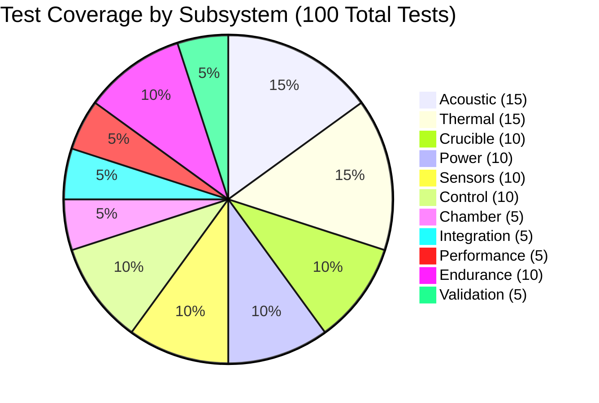
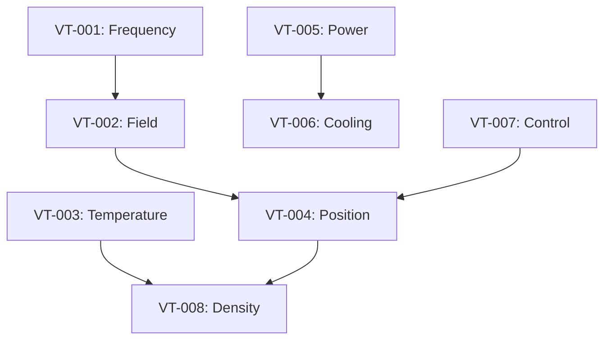

# Verification Matrix

## Test Coverage Overview

## Complete Test Registry

The DRIP system verification comprises **100 comprehensive tests** organized into 11 categories. 

### 📋 Full Test List
**[View Complete Test Registry →](test-registry.md)**

The test registry includes all 100 tests (TE-001 through TE-100) with:
- Test purpose and acceptance criteria
- Target components
- Prerequisites and dependencies
- Required equipment
- Estimated duration

### Summary by Category

| Category | Test Range | Count | Total Hours | Focus Area |
|----------|------------|-------|-------------|------------|
| Acoustic | TE-001 to TE-015 | 15 | 67h | Transducers, amplifiers, acoustic field |
| Thermal | TE-016 to TE-030 | 15 | 83h | Cameras, sensors, cooling, insulation |
| Crucible | TE-031 to TE-040 | 10 | 54h | Heating, droplet generation, materials |
| Power | TE-041 to TE-050 | 10 | 35h | Power supplies, distribution, safety |
| Sensors | TE-051 to TE-060 | 10 | 41h | Calibration, integration, accuracy |
| Control | TE-061 to TE-070 | 10 | 44h | Controllers, algorithms, interfaces |
| Chamber | TE-071 to TE-075 | 5 | 20h | Sealing, filtration, environment |
| Integration | TE-076 to TE-080 | 5 | 40h | Subsystem interaction, safety |
| Performance | TE-081 to TE-085 | 5 | 82h | System accuracy, speed, quality |
| Endurance | TE-086 to TE-095 | 10 | 4,581h | Long-term reliability testing |
| Validation | TE-096 to TE-100 | 5 | 100h | Final acceptance testing |
| **TOTAL** | **TE-001 to TE-100** | **100** | **5,147h** | **Complete system verification** |

## Test Dependencies

## Test Schedule

| Week | Tests | Duration | Resources |
|------|-------|----------|-----------|
| 1 | VT-001, VT-005 | 2 days | 2 engineers |
| 2 | VT-002, VT-007 | 3 days | 2 engineers |
| 3 | VT-003, VT-006 | 4 days | 3 engineers |
| 4 | VT-004, VT-008 | 5 days | 3 engineers |
| 5 | VT-009, VT-010 | 2 days | 1 engineer |
| 6 | Integration tests | 5 days | 4 engineers |

## Test Equipment Requirements

### Measurement Equipment
- Keysight DSOX3024T Oscilloscope
- Brüel & Kjær 8103 Hydrophone
- FLIR A655sc Thermal Camera
- Photron NOVA S20 High-speed Camera
- Yokogawa WT1800E Power Analyzer

### Test Fixtures
- Acoustic field mapping rig
- Temperature calibration furnace
- Vibration isolation table
- EMC test chamber (external)

### Consumables
- Test samples (Al, Steel)
- Thermocouples (Type K, R)
- Calibration standards
- Safety equipment

## Risk Mitigation

| Risk | Impact | Mitigation |
|------|--------|------------|
| Equipment unavailable | Schedule delay | Book equipment early, have alternatives |
| Test failure | Redesign needed | Prototype testing, simulations |
| Safety incident | Injury, delay | Safety procedures, training |
| Invalid results | Repeat testing | Calibration, procedure review |

## Success Metrics

- **Test Completion**: 100% of planned tests
- **First-Pass Yield**: >80% pass on first attempt
- **Documentation**: 100% complete test reports
- **Schedule**: Within ±1 week of plan
- **Budget**: Within 10% of allocated funds
