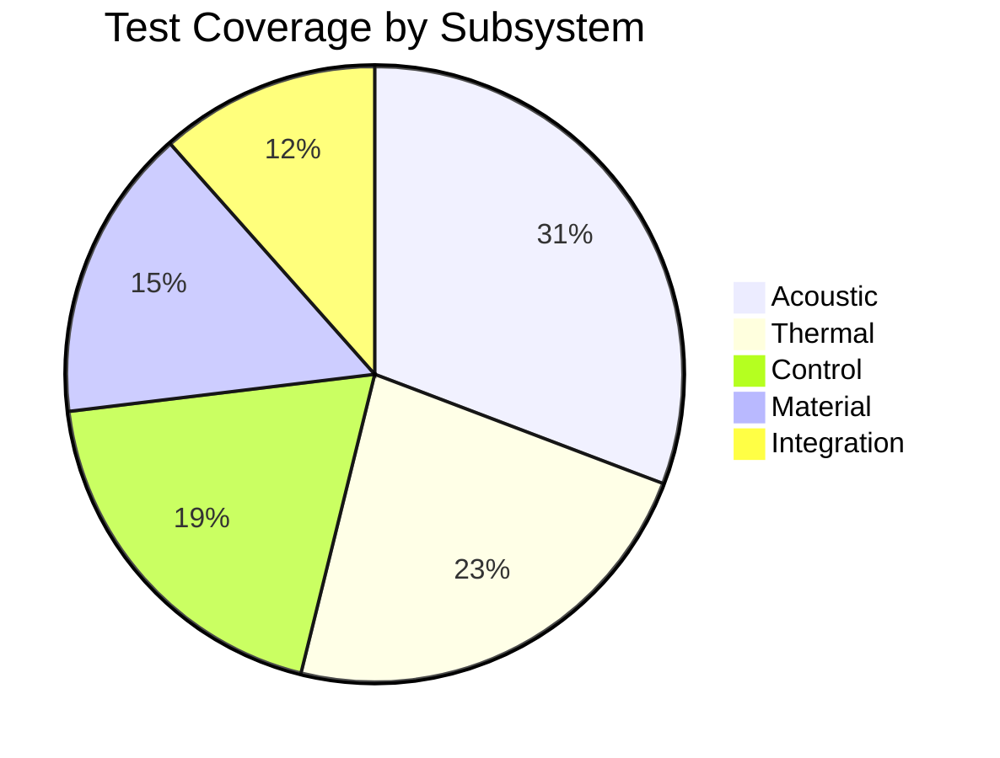
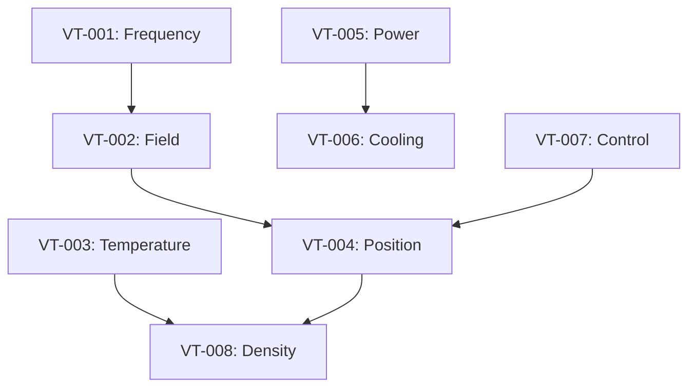

!!! warning "Documentation Status: PLANNING PHASE"
    This documentation represents the **PLANNED DESIGN** for the DRIP system.
    - **Hardware Status**: Not built
    - **Testing Status**: Not performed  
    - **Verification**: Simulation only
    - **Specifications**: Subject to change based on prototype results

# Verification Matrix

## Test Coverage Overview

## Verification Test Matrix

| Test ID | Requirement | Test Method | Equipment | Pass Criteria | Priority |
|---------|-------------|-------------|-----------|---------------|----------|
| VT-001 | 40kHz frequency | Spectrum analysis | Oscilloscope, FFT | 40±0.1 kHz | HIGH |
| VT-002 | Field uniformity | Hydrophone scan | Hydrophone array | ±5% variation | HIGH |
| VT-003 | Temperature range | Thermal test | Thermocouples | 700-1580°C | HIGH |
| VT-004 | Position accuracy | Optical tracking | High-speed camera | ±0.3mm | HIGH |
| VT-005 | Power consumption | Power analysis | Power meter | <5kW net | MEDIUM |
| VT-006 | Cooling capacity | Thermal load test | Flow meter, sensors | ΔT<10°C | MEDIUM |
| VT-007 | Control latency | Response time | Logic analyzer | <100μs | MEDIUM |
| VT-008 | Material density | Archimedes test | Precision scale | >95% theoretical | HIGH |
| VT-009 | Surface finish | Profilometry | Surface profiler | <50μm Ra | LOW |
| VT-010 | EMC compliance | EMI/EMC test | Spectrum analyzer | IEC 61000 | LOW |

## Test Dependencies

## Test Schedule

| Week | Tests | Duration | Resources |
|------|-------|----------|-----------|
| 1 | VT-001, VT-005 | 2 days | 2 engineers |
| 2 | VT-002, VT-007 | 3 days | 2 engineers |
| 3 | VT-003, VT-006 | 4 days | 3 engineers |
| 4 | VT-004, VT-008 | 5 days | 3 engineers |
| 5 | VT-009, VT-010 | 2 days | 1 engineer |
| 6 | Integration tests | 5 days | 4 engineers |

## Test Equipment Requirements

### Measurement Equipment
- Keysight DSOX3024T Oscilloscope
- Brüel & Kjær 8103 Hydrophone
- FLIR A655sc Thermal Camera
- Photron NOVA S20 High-speed Camera
- Yokogawa WT1800E Power Analyzer

### Test Fixtures
- Acoustic field mapping rig
- Temperature calibration furnace
- Vibration isolation table
- EMC test chamber (external)

### Consumables
- Test samples (Al, Steel)
- Thermocouples (Type K, R)
- Calibration standards
- Safety equipment

## Risk Mitigation

| Risk | Impact | Mitigation |
|------|--------|------------|
| Equipment unavailable | Schedule delay | Book equipment early, have alternatives |
| Test failure | Redesign needed | Prototype testing, simulations |
| Safety incident | Injury, delay | Safety procedures, training |
| Invalid results | Repeat testing | Calibration, procedure review |

## Success Metrics

- **Test Completion**: 100% of planned tests
- **First-Pass Yield**: >80% pass on first attempt
- **Documentation**: 100% complete test reports
- **Schedule**: Within ±1 week of plan
- **Budget**: Within 10% of allocated funds
