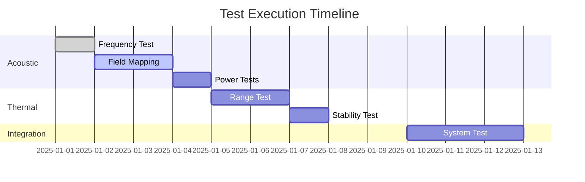

# Test Reports

## Test Report Summary

### Overall Status
- **Total Tests Planned**: 26
- **Tests Completed**: 0
- **Tests Passed**: 0
- **Tests Failed**: 0
- **Tests Blocked**: 0

### Test Progress


## Completed Test Reports

### TR-001: Acoustic Frequency Verification
**Date**: [Pending]  
**Status**: Not Started  
**Engineer**: [Assigned]

**Summary**: Verification of 40kHz operating frequency across all transducers.

**Results**:
- Target: 40.0 ± 0.1 kHz
- Measured: [Pending]
- Pass/Fail: [Pending]

**Issues**: None identified

**Data Files**: `/test_data/TR-001/`

---

### TR-002: Acoustic Field Uniformity
**Date**: [Pending]  
**Status**: Not Started  
**Engineer**: [Assigned]

**Summary**: Mapping of acoustic pressure field throughout build volume.

**Results**:
- Target: ±5% uniformity
- Measured: [Pending]
- Pass/Fail: [Pending]

**Issues**: None identified

**Data Files**: `/test_data/TR-002/`

---

## Test Report Template

```markdown
# Test Report: TR-XXX

## Test Information
- **Test Name**: 
- **Test ID**: TR-XXX
- **Date Performed**: YYYY-MM-DD
- **Test Engineer**: 
- **Witness**: 
- **Duration**: X hours

## Test Configuration
- **Hardware Version**: 
- **Software Version**: 
- **Environmental Conditions**:
  - Temperature: °C
  - Humidity: %
  - Pressure: mbar

## Test Objectives
1. 
2. 
3. 

## Test Setup
[Diagram or photo of test setup]

### Equipment Used
| Equipment | Model | Serial # | Cal Due |
|-----------|-------|----------|---------|
| | | | |

## Test Procedure
[Reference to detailed procedure or summary]

## Results

### Measurements
| Parameter | Target | Measured | Units | Pass/Fail |
|-----------|--------|----------|-------|-----------|
| | | | | |

### Observations
- 
- 

### Data Analysis
[Plots, statistics, analysis]

## Conclusions
- **Overall Result**: PASS / FAIL
- **Key Findings**:
  1. 
  2. 

## Issues and Deviations
| Issue # | Description | Impact | Resolution |
|---------|-------------|--------|------------|
| | | | |

## Recommendations
1. 
2. 

## Attachments
- Raw data files: 
- Analysis scripts: 
- Photos: 

## Approval
- Test Engineer: _____________ Date: _______
- Reviewer: _________________ Date: _______
- QA: ______________________ Date: _______
```

## Data Management

### File Naming Convention
`TR-XXX_[TestName]_[YYYYMMDD]_[Version].[ext]`

Example: `TR-001_FrequencyTest_20250115_v1.csv`

### Data Archive Structure
```
/test_data/
├── TR-001/
│   ├── raw_data/
│   ├── processed_data/
│   ├── analysis/
│   └── report/
├── TR-002/
│   └── ...
```

### Data Retention
- Raw data: Permanent archive
- Processed data: 5 years
- Reports: Permanent
- Calibration records: 2 years past expiry

## Lessons Learned Log

### Testing Best Practices
1. **Always verify calibration before testing**
2. **Document unexpected observations immediately**
3. **Take photos of all test setups**
4. **Save raw data before any processing**
5. **Use version control for analysis scripts**

### Common Issues Encountered
- Electromagnetic interference affecting measurements
- Temperature drift during long tests
- Inconsistent grounding causing noise
- Software crashes losing data

### Improvement Recommendations
- Implement automated data collection
- Add redundant measurement channels
- Improve EMI shielding
- Regular software updates

## Test Metrics Dashboard

| Metric | Target | Current | Trend |
|--------|--------|---------|-------|
| Test Completion | 100% | 0% | → |
| First Pass Yield | >80% | N/A | → |
| Avg Test Duration | <4 hrs | N/A | → |
| Documentation | 100% | 25% | ↑ |
| Issues per Test | <2 | N/A | → |
