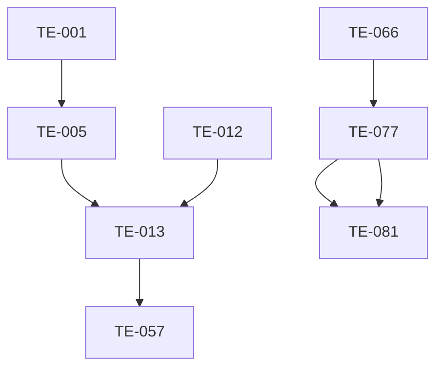

# Test Planning & Scheduling
!!! danger "PLANNING DOCUMENTATION ONLY"
    **No hardware exists. No simulations completed. These are conceptual targets only.**

[← Back to Dashboard](index.md)

## Test Execution Plan

### Next Available Tests
Tests ready for immediate execution (all prerequisites met):

| Priority | Test ID | Test Name | Duration | Equipment Required |
|----------|---------|-----------|----------|-------------------|
| 1 | TE-001 | Individual Transducer Frequency Characterization | 3.0h | Network Analyzer, Temperature Chamber... |
| 2 | TE-003 | Transducer Impedance Matching | 2.0h | Impedance Analyzer, Calibration Kit |
| 3 | TE-012 | Phase Array Controller Verification | 4.0h | Logic Analyzer, High-Speed Oscilloscope |
| 4 | TE-016 | Thermal Camera Calibration | 4.0h | Blackbody Calibrator, Reference Thermocouples |
| 5 | TE-068 | Data Logging Verification | 3.0h | Data Generator, Analysis Tools |
| 6 | TE-041 | Main Power Supply Load Test | 4.0h | Electronic Load Bank, Power Analyzer |
| 7 | TE-031 | Crucible Temperature Range | 8.0h | Optical Pyrometer, Induction Power Supply |
| 8 | TE-034 | Piezo Dispenser Frequency Response | 3.0h | Function Generator, Laser Vibrometer |

**Total Duration**: 31.0 hours (3.9 days at 8h/day)

### Test Dependencies

Critical path tests and their dependencies:

### Resource Requirements

#### Equipment Usage Schedule

| Equipment | Total Tests | Total Hours | Utilization |
|-----------|-------------|-------------|-------------|
| Data Logger | 7 | 200.0h | 25.0% |
| Thermal Camera | 6 | 29.0h | 3.6% |
| Network Analyzer | 4 | 14.0h | 1.8% |
| Power Meter | 4 | 14.0h | 1.8% |
| Spectrum Analyzer | 4 | 20.0h | 2.5% |
| Power Analyzer | 3 | 11.0h | 1.4% |
| Signal Generator | 3 | 10.0h | 1.2% |
| Load Bank | 2 | 172.0h | 21.5% |
| 3D Positioning System | 2 | 16.0h | 2.0% |
| Oscilloscope | 2 | 6.0h | 0.8% |

### Proposed Schedule

#### Week 1-2: Critical Component Tests
- Focus on acoustic and thermal subsystems
- Establish baseline performance

#### Week 3-4: Integration Testing  
- System-level integration
- Control loop validation

#### Week 5-6: Performance & Endurance
- Full system characterization
- Long-duration testing

#### Week 7-8: Final Validation
- Customer acceptance tests
- Documentation completion

### Risk Mitigation

| Risk | Impact | Mitigation Strategy |
|------|--------|-------------------|
| Equipment failure | High | Maintain calibrated backup equipment |
| Test delays | Medium | Parallel test execution where possible |
| Failed tests | High | Root cause analysis process defined |
| Resource conflicts | Medium | Detailed scheduling and coordination |
