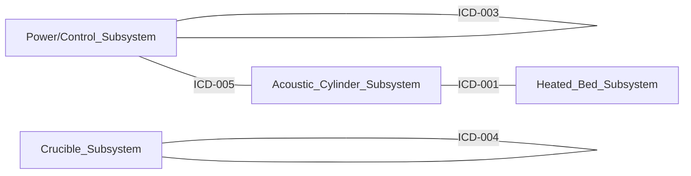

# Interface Control Document Summary

**Generated**: 2025-09-22 22:07:09
**System**: Acoustic Manufacturing System L1
**Total Interfaces**: 5

## Interface Overview

| ICD # | Interface | Criticality | Status | Types |
|-------|-----------|-------------|--------|-------|
| [ICD-001](ICD-001_Acoustic_Thermal_Interface.md) | Acoustic-Thermal Interface | HIGH | Draft | mechanical, thermal, acoustic |
| [ICD-002](ICD-002_Control_Power_Interface.md) | Control-Power Interface | HIGH | Draft | electrical, data |
| [ICD-003](ICD-003_Sensor_Control_Interface.md) | Sensor-Control Interface | MEDIUM | Draft | data, electrical |
| [ICD-004](ICD-004_Induction_Crucible_Interface.md) | Induction-Crucible Interface | HIGH | Draft | thermal, electrical, mechanical |
| [ICD-005](ICD-005_Amplifier_Transducer_Interface.md) | Amplifier-Transducer Interface | HIGH | Draft | electrical, acoustic |

## Component-Interface Traceability

| Component | Interfaces |
|-----------|------------|
| 15kW PSU | ICD-002 |
| 40kHz Transducers | ICD-001, ICD-005 |
| 6-Channel Amp Modules | ICD-005 |
| Acoustic Cylinder | ICD-001 |
| Chamber Assembly | ICD-001 |
| Control Bus PCB | ICD-005 |
| Crucible Assembly | ICD-004 |
| FPGA Board | ICD-002 |
| Induction Coil Assembly | ICD-004 |
| Induction Heater | ICD-004 |
| Industrial PC | ICD-003 |
| Material Feed System | ICD-004 |
| STM32 Dev Board | ICD-002 |
| Thermal Camera - Optris Xi 400 | ICD-003 |
| Thermal Isolation Tube | ICD-001 |
| Transducer Array Layer | ICD-001, ICD-005 |

## Interface Matrix

