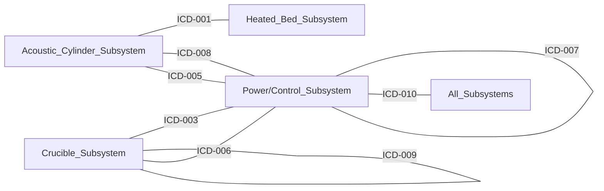

# Interface Control Document Summary

**Generated**: 2025-09-14 20:28:20
**System**: Acoustic Manufacturing System L1
**Total Interfaces**: 10

## Interface Overview

| ICD # | Interface | Criticality | Status | Types |
|-------|-----------|-------------|--------|-------|
| [ICD-001](ICD-001_Acoustic_Thermal_Interface.md) | Acoustic-Thermal Interface | HIGH | Draft | mechanical, thermal, acoustic |
| [ICD-002](ICD-002_Control_Power_Interface.md) | Control-Power Interface | HIGH | Draft | electrical, data |
| [ICD-003](ICD-003_Sensor_Control_Interface.md) | Sensor-Control Interface | MEDIUM | Draft | data, electrical |
| [ICD-004](ICD-004_Induction_Crucible_Interface.md) | Induction-Crucible Interface | HIGH | Draft | thermal, electrical, mechanical |
| [ICD-005](ICD-005_Amplifier_Transducer_Interface.md) | Amplifier-Transducer Interface | HIGH | Draft | electrical, acoustic |
| [ICD-006](ICD-006_Crucible_Material_Feed_Interface.md) | Crucible Material Feed Interface | HIGH | Draft | electrical, data, mechanical |
| [ICD-007](ICD-007_Thermal_Camera_Data_Interface.md) | Thermal Camera Data Interface | HIGH | Draft | data |
| [ICD-008](ICD-008_Acoustic_Array_Phasing_Interface.md) | Acoustic Array Phasing Interface | HIGH | Draft | electrical, data |
| [ICD-009](ICD-009_Multi_Outlet_Distribution_Interface.md) | Multi-Outlet Distribution Interface | HIGH | Draft | mechanical, thermal |
| [ICD-010](ICD-010_Emergency_Shutdown_Interface.md) | Emergency Shutdown Interface | HIGH | Draft | electrical, data |

## Component-Interface Traceability

| Component | Interfaces |
|-----------|------------|
| 10kW PSU | ICD-002 |
| 12V DC Power Supply | ICD-002 |
| 25-Outlet Manifold | ICD-009 |
| 40kHz Transducers | ICD-001, ICD-005 |
| 48V DC Power Supply | ICD-002 |
| 6-Channel Amp Modules | ICD-005 |
| Acoustic Cylinder | ICD-001 |
| All Power Components | ICD-010 |
| Chamber Assembly | ICD-001 |
| Control Bus PCB | ICD-005 |
| Crucible Assembly | ICD-004 |
| Cyclone IV FPGA Board | ICD-002 |
| DAC Array | ICD-008 |
| Distribution Valves | ICD-009 |
| E-Stop Controller | ICD-010 |
| FPGA Board | ICD-007, ICD-008 |
| Feed Controller | ICD-006 |
| Flow Controllers | ICD-009 |
| Induction Coil Assembly | ICD-004 |
| Induction Heater | ICD-004 |
| Industrial PC | ICD-003, ICD-007 |
| Material Feed Motor | ICD-006 |
| Material Feed System | ICD-004 |
| Motor Driver | ICD-006 |
| Optris PI 1M | ICD-007 |
| Optris PI 1M Thermal Camera | ICD-003 |
| Phase Shifters | ICD-008 |
| Pressure Sensors | ICD-009 |
| STM32 Dev Board | ICD-002, ICD-006 |
| Safety PLC | ICD-010 |
| Thermal Isolation Tube | ICD-001 |
| Transducer Array | ICD-008 |
| Transducer Array Layer | ICD-001, ICD-005 |

## Interface Matrix

